# KLWPエディタ 現行設計仕様

この文書は、現在の `klwp_editor.py` と `klwp/` パッケージを基準にした設計資料です。図はすべて Mermaid 形式で記述しています。

- 対象実装: 2026-07-22 時点
- 実行入口: `klwp_editor.py`
- 合成ルート: `klwp/editor.py` の `EditorApp`
- 永続化対象: ZIP 形式の `.klwp` ファイル
- 一時状態: `ApplicationMemory` に集約された、保存されない編集・プレビュー状態

## 1. 設計の全体像

`EditorApp` は、責務別の Mixin を組み合わせる合成ルートです。各 Mixin は状態を直接保持せず、`ApplicationMemory` を介して共同作業します。KLWP ファイルそのものは `KlwpArchive` が管理し、描画は Pillow 上で合成した後に Tk Canvas へ表示します。

| 領域 | 主な責務 | 主な実装場所 |
| --- | --- | --- |
| エントリーポイント | 実行条件の確認と GUI 起動 | `klwp_editor.py` |
| アプリケーション合成 | Mixin と `tk.Tk` の統合 | `klwp/editor.py` |
| ドキュメント | 新規、読込、保存、履歴、モジュール操作 | `klwp/ui/document.py` |
| UI | ウィンドウ、ツリー、プロパティ、設定ダイアログ | `klwp/ui/` |
| 描画 | Canvas、配置、合成、図形、文字、画像 | `klwp/render/` |
| プレビュー | 数式値、スイッチ、ページ、アニメーション | `klwp/preview/` |
| KLWP形式 | ZIP、`preset.json`、画像、フォント | `klwp/archive.py` |
| 値と状態 | 値オブジェクト、履歴、コレクション | `klwp/values.py` ほか |
| Kode/SVG | 数式評価、SVG Path の解析とマスク化 | `klwp/formula.py`, `klwp/svg.py` |
| Android転送 | adb検出、端末選択、保存済み成果物のpush | `klwp/adb.py`, `klwp/ui/adb_transfer.py` |

## 2. クラス図

### 2.1 EditorApp の合成

`EditorApp` 自身は起動定数とプロパティ定義だけを持ち、処理は Mixin に分散されています。`BootstrapMixin` が唯一のアプリケーション状態 `memory` を生成します。

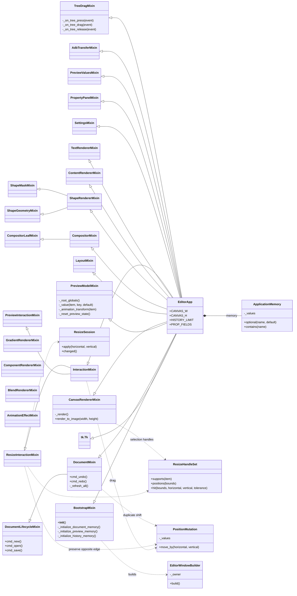

### 2.2 KLWPアーカイブ、値、履歴

`.klwp` は ZIP として扱われます。`ArchiveContents` は `preset.json`、ビットマップ、フォント、その他エントリー、ファイル位置をひとまとめにしたファーストクラスコレクションです。

画像エントリー名は `bitmaps/IMG` にUUIDの32桁hexを続けます。ZIPエントリーにはKLWP実機と同じUTF-8・data descriptorフラグ `0x808` を設定します。旧版で生成された28桁IDは、`BitmapReferenceNormalizer` が画像名と `preset.json` 内の参照を同時に32桁へ移行します。

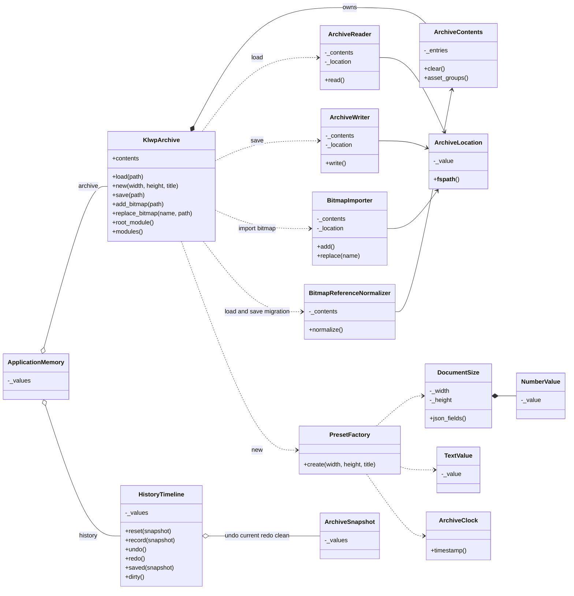

### 2.3 描画パイプライン

`CanvasRendererMixin` が描画全体を開始し、`CompositorMixin` がモジュールツリーを再帰的に合成します。値解決、アニメーション、配置計算を行った後、モジュール種別ごとのレンダラーへ振り分けます。ルート要素の `position_offset_x/y` はアンカーからの距離であり、左上からの絶対座標ではありません。Overlap/Stack内の子要素は四辺の `position_padding_*` を余白として配置し、端アンカーは対応する辺、中央系アンカーは両側余白の差の半分を使用します。アンカー未指定時はCENTER（中央）として扱います。

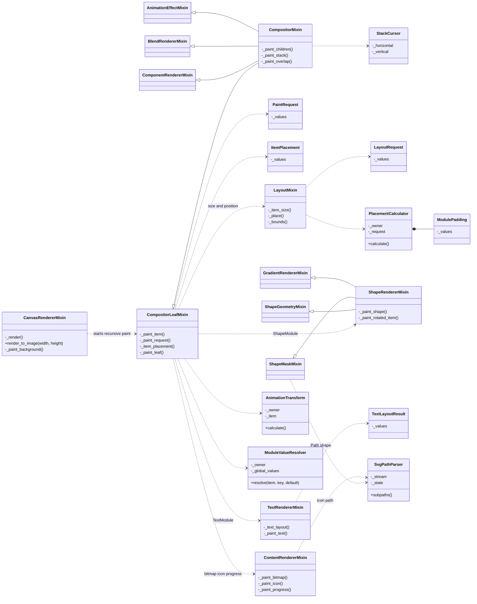

### 2.4 プレビュー、アニメーション、Kode数式

プレビュー状態は KLWP アーカイブへ保存されません。現在ページ、スイッチの目標値と補間値、ループ開始時刻、タップ領域などは `ApplicationMemory` 内だけに存在します。

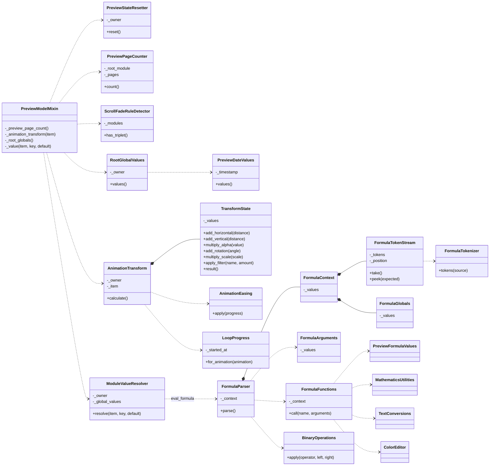

### 2.5 UIの協調クラス

UI クラスは `EditorApp` を owner として受け取り、処理が確定した時点で `DocumentMixin` または `PropertyPanelMixin` の更新処理へ戻します。

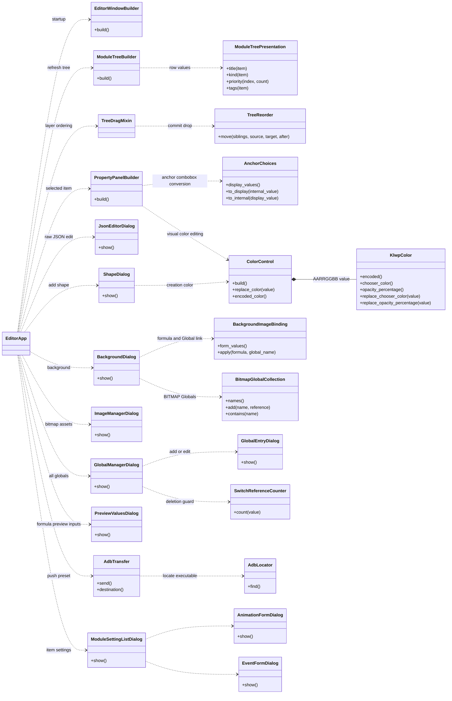

## 3. シーケンス図

### 3.1 アプリケーション起動

起動時は空の KLWP プリセットを生成し、UI 構築後にプレビュー状態と履歴を初期化して、最初の画面を描画します。

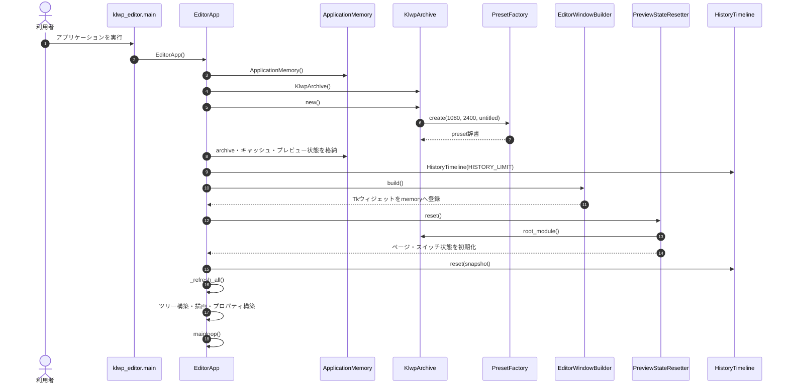

### 3.2 KLWPファイルを開いて描画する

読込後の描画では、最上位モジュールごとに値解決、アニメーション変換、配置、種別別描画、子要素の再帰処理を実行します。

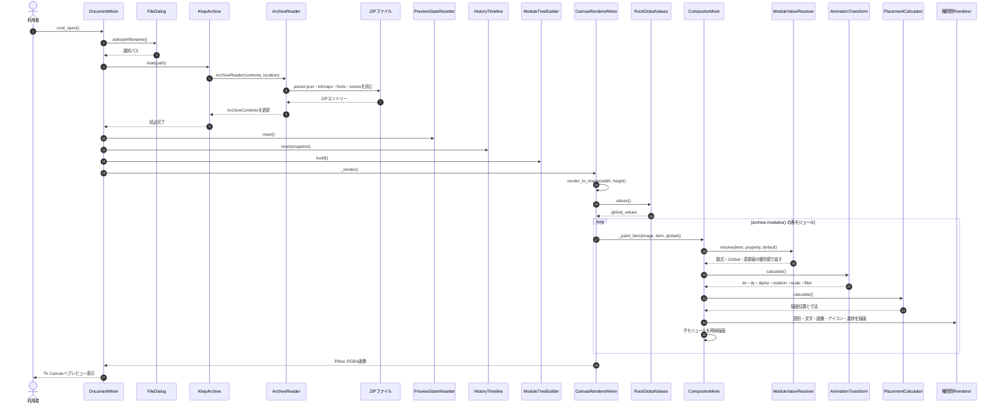

### 3.3 プロパティ編集とUndo／Redo

履歴には差分ではなく、KLWP アーカイブのスナップショットを保存します。保存時点のスナップショットを `clean` とし、現在値との差で未保存状態を判定します。

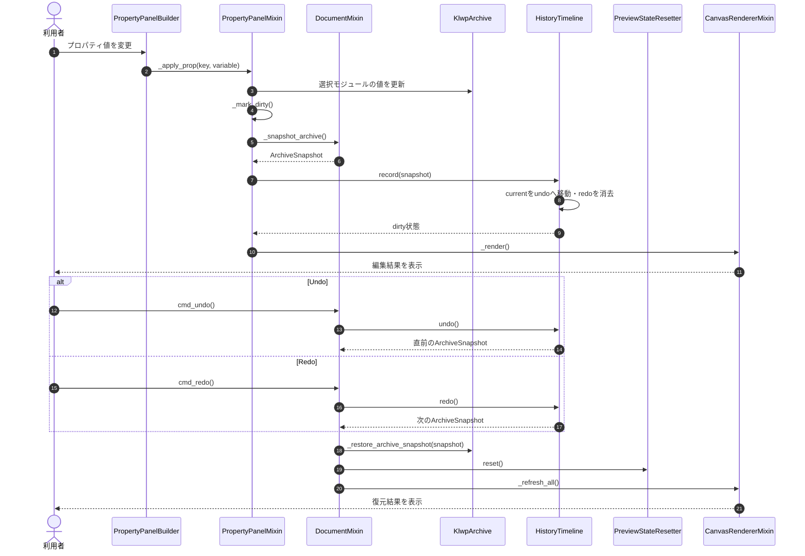

### 3.4 保存処理

`ArchiveWriter` は現在の `ArchiveContents` から `preset.json` とアセット群を ZIP 圧縮し、`.klwp` として書き出します。

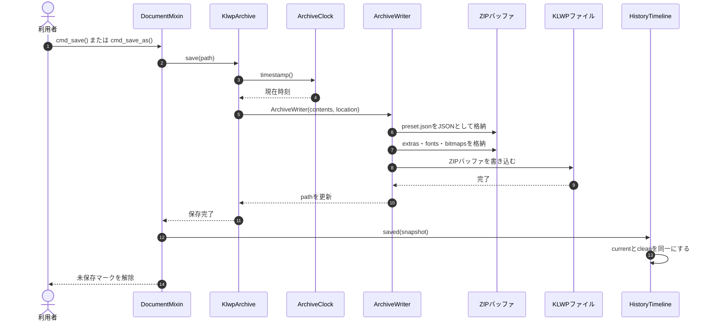

### 3.5 タップによるスイッチアニメーション

描画時に `internal_events` を持つモジュールの領域を登録します。操作プレビューモードでタップすると、該当領域のイベントを実行し、スイッチ値を 300ms で補間します。Android アプリ起動など外部アクションはステータス表示だけで終了します。

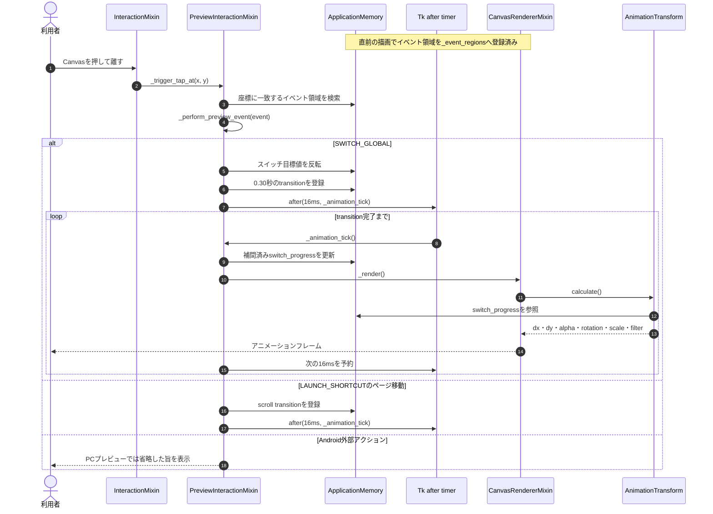

### 3.6 横スワイプによるページ追従

ドラッグ中はポインタ移動量を Canvas 幅で割って連続的なページ位置へ変換します。指を離した後は最寄りページへ 250ms でスムーズに吸着します。

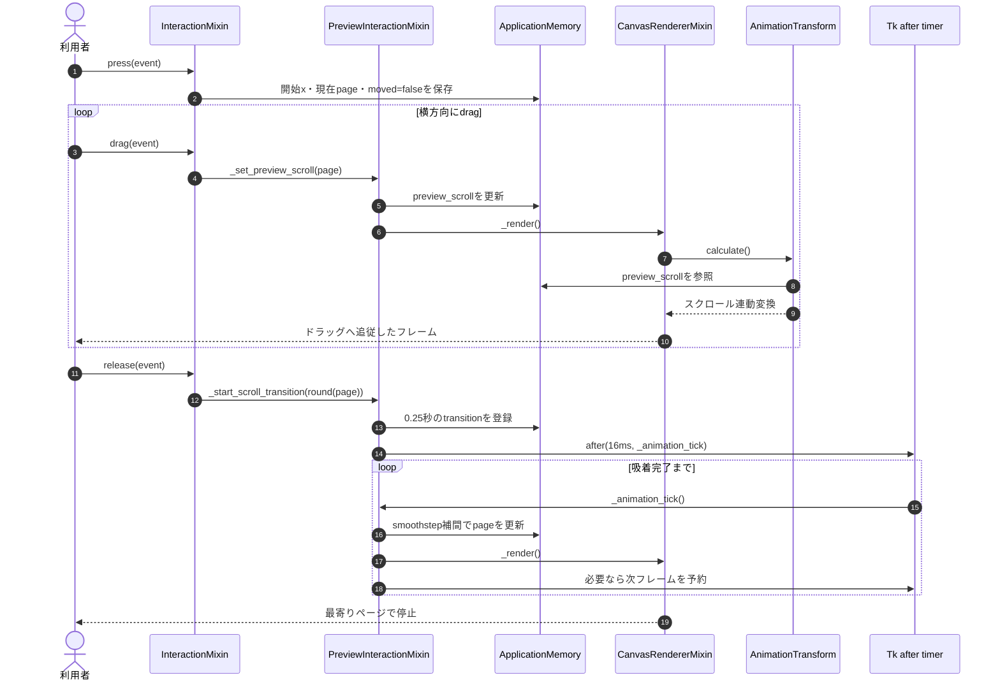

### 3.7 図形・画像の直接リサイズ

編集モードで選択したShapeまたはBitmapには8方向のハンドルを表示します。Shapeはドラッグした軸を個別に変更し、Bitmapはどのハンドルでも現在の縦横比を維持します。サイズ変更後は、ルート要素ならアンカー基準オフセット、レイヤー内の子要素なら四辺余白を補正し、ドラッグしていない反対側の縁を固定します。描画時に全モジュールの境界を記録するため、Overlap内の子要素も最前面から選択・リサイズできます。

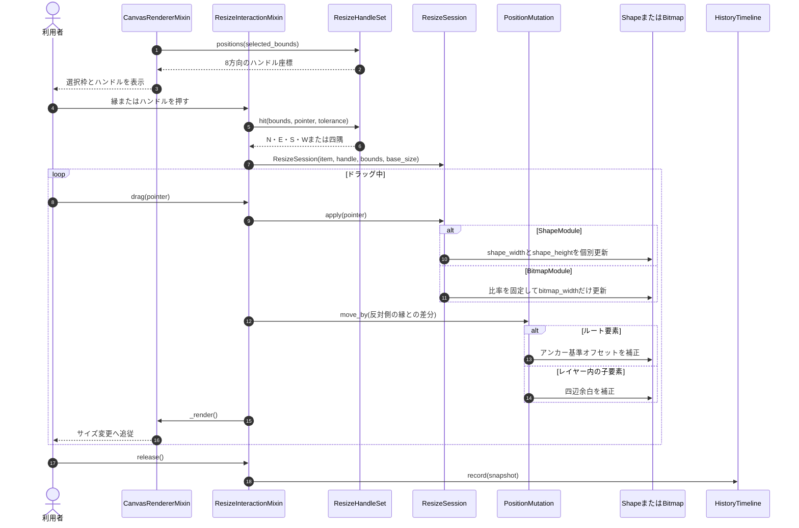

### 3.8 ADBによるAndroid端末への転送

転送コマンドは編集中のプリセットを先に保存し、PATHまたはAndroid SDKから`adb`を検出します。接続状態が`device`の端末が1台だけであることを確認してから、KLWPのwallpapersディレクトリを作成し、保存済み`.klwp`を転送します。

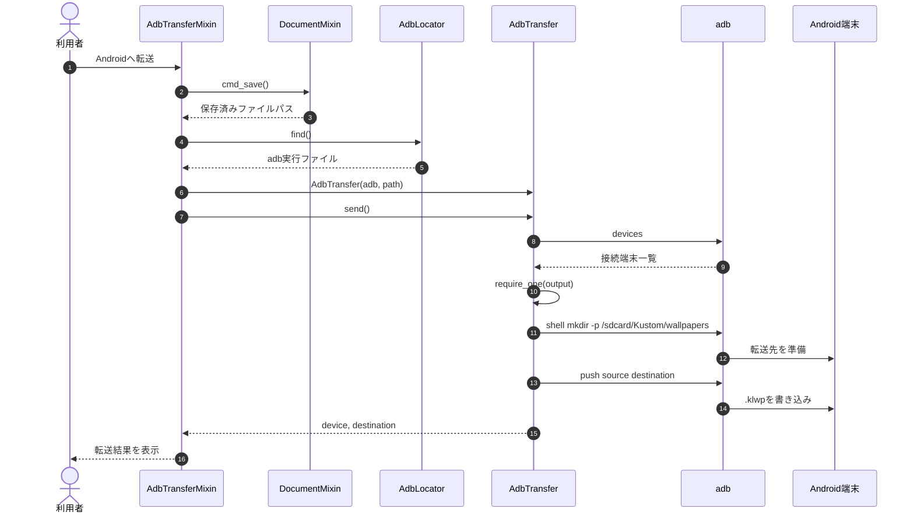

### 3.9 要素ツリーのドラッグによる表示優先度変更

ツリーはKLWPの配列順と同じく上から背面、下ほど前面として表示します。ドラッグ元とドロップ先が同じ兄弟コレクションに属する場合だけ、対象行の前または後へ移動します。別レイヤーへのドロップは階層構造を変えてしまうため受け付けません。変更はドロップ時に一度だけ履歴へ記録され、Undo/Redoできます。

子要素を持つレイヤーが選択中の場合、新規要素の追加先はそのレイヤーです。「選択解除（ルート）」ボタン、ツリーの空白クリック、またはEscキーで選択を解除すると、`selected` とTreeviewの選択を同時に消去し、以降の追加先をルートの `modules` へ戻します。選択解除自体は成果物を変更しないため履歴には記録しません。

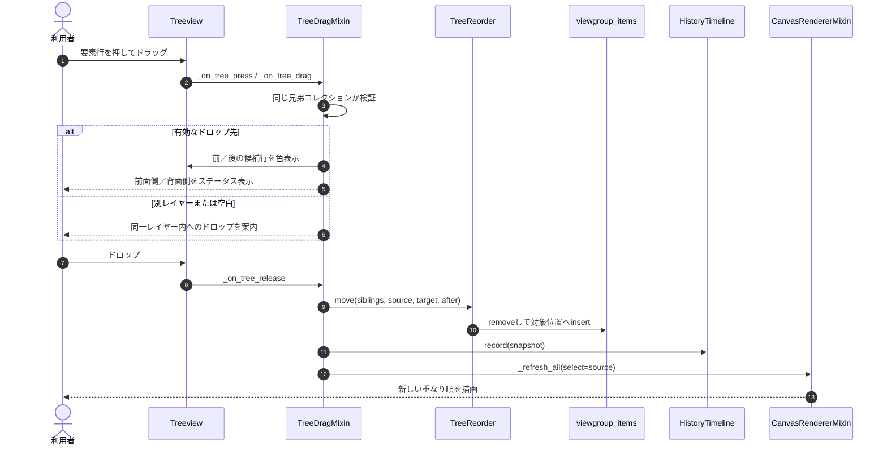

### 3.10 数式・BITMAP Globalによる背景切替

背景設定は固定画像に加え、`internal_globals.background_bitmap` のBITMAP型Globalリンクと、`internal_formulas.background_bitmap` のKode数式を編集します。数式がある場合は数式、次にGlobalリンク、最後に固定の `background_bitmap` という通常の値解決優先順位を使用します。プレビュー値で日時を変更すると `df(H)` などが再評価され、Globalに保存されたアーカイブ内画像パスから背景を再描画します。

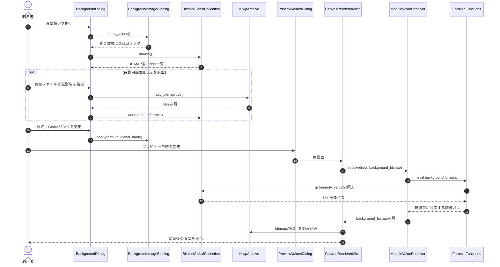

## 4. 状態とデータの境界

### 4.1 `ApplicationMemory` の主な内容

| 分類 | キーの例 | 保存対象 |
| --- | --- | --- |
| ドキュメント | `archive`, `device_res`, `selected` | `archive` の内容だけ `.klwp` に保存 |
| 履歴 | `history`, `dirty` | 保存しない |
| UI | `tree`, `canvas`, `status`, 各ボタン | 保存しない |
| キャッシュ | `photo_cache`, `font_cache`, `_photo`, `_item_bounds` | 保存しない |
| 編集操作 | `drag_state`, `resize_state`, `tree_drag` | 保存しない |
| プレビュー | `preview_scroll`, `preview_switches`, `preview_switch_progress`, `preview_values`, `preview_ts` | 保存しない |
| アニメーション | `_switch_transitions`, `_scroll_transition`, `_loop_started_at` | 保存しない |
| イベント | `_event_regions`, `interaction_drag` | 保存しない |

### 4.2 KLWP値の解決優先順位

`ModuleValueResolver` は、描画プロパティを次の順序で解決します。

1. `internal_formulas[key]` にある Kode 数式
2. `internal_globals[key]` が参照する Global 値または Global 数式
3. モジュール自身の `item[key]`
4. 呼出側が指定した既定値

### 4.3 モジュール描画の振り分け

| `internal_type` | 主な描画先 |
| --- | --- |
| `ShapeModule` | `ShapeRendererMixin` |
| `TextModule` | `TextRendererMixin` |
| `FontIconModule` | `ContentRendererMixin._paint_icon()` |
| `BitmapModule` | `ContentRendererMixin._paint_bitmap()` |
| `KomponentModule` | `ComponentRendererMixin`（`config_scale_value` を適用して再帰合成） |
| `ProgressModule` | `ContentRendererMixin._paint_progress()` |
| `StackLayerModule` | `CompositorMixin._paint_stack()` |
| `OverlapLayerModule` など子要素を持つもの | `CompositorMixin._paint_overlap()` |

## 5. 保守時の更新指針

- `EditorApp` の継承 Mixin を追加・削除した場合は「2.1 EditorApp の合成」を更新する。
- KLWP ZIP の格納項目を変更した場合は「2.2」と「3.4」を更新する。
- 描画順、値解決順、子要素の合成方法を変更した場合は「2.3」と「3.2」を更新する。
- 新しいアニメーション反応・アクションを追加した場合は「2.4」「3.5」「3.6」を更新する。
- リサイズ対象・ハンドル・比率制約を変更した場合は「2.1」と「3.7」を更新する。
- 要素ツリーの順序・ドロップ制約を変更した場合は「2.5」と「3.9」を更新する。
- `ApplicationMemory` の状態分類を増やした場合は「4.1」を更新する。
- Mermaid 図のクラス名とメソッド名は、コード上の識別子と一致させる。
