# KLWPエディタ 現行設計仕様

この文書は、現在の `klwp_editor.py` と `klwp/` パッケージを基準にした設計資料です。図はすべて Mermaid 形式で記述しています。

- 対象実装: 2026-08-03 時点
- 実行入口: `klwp_editor.py`
- 合成ルート: `klwp/editor.py` の `EditorApp`
- 永続化対象: ZIP 形式の `.klwp` ファイル
- 一時状態: `ApplicationMemory` 配下の責務別partitionに分離された編集・プレビュー状態

## 1. 設計の全体像

`EditorApp` は、相互協調の強い描画・編集Mixinと `EditorServices` を組み合わせる合成ルートです。PNG書き出し、コマンドパレット、整列、表示操作、ADB転送、時刻プレビューは継承せず構成サービスとして束ねます。一時状態は `ApplicationMemory` の責務別partition、確定編集は `EditCommandExecutor` を境界として扱います。KLWPファイルそのものは `KlwpArchive` が管理し、描画はPillow上で合成した後にTk Canvasへ表示します。

| 領域 | 主な責務 | 主な実装場所 |
| --- | --- | --- |
| エントリーポイント | 実行条件の確認と GUI 起動 | `klwp_editor.py` |
| アプリケーション合成 | Mixin と `tk.Tk` の統合 | `klwp/editor.py` |
| 構成サービス | 独立UI機能、編集Commandの実行 | `klwp/ui/services.py`, `klwp/ui/features.py`, `klwp/ui/command_execution.py` |
| 編集Command | UI非依存の文書変更と結果 | `klwp/commands.py` |
| ドキュメント | 新規、読込、保存、履歴、モジュール操作 | `klwp/ui/document.py` |
| UI | ウィンドウ、ツリー、プロパティ、設定ダイアログ | `klwp/ui/` |
| 描画 | Canvas、配置、合成、図形、文字、画像 | `klwp/render/` |
| プレビュー | 数式値、スイッチ、ページ、アニメーション | `klwp/preview/` |
| KLWP形式 | ZIP、`preset.json`、画像、フォント | `klwp/archive.py` |
| 値と状態 | 値オブジェクト、履歴、コレクション | `klwp/values.py` ほか |
| Kode/SVG | 数式評価、SVG Path の解析とマスク化 | `klwp/formula.py`, `klwp/svg.py` |
| 画像差分 | 実機スクショとの指標、ヒートマップ、品質ゲート | `klwp/pixel_diff.py`, `tools/compare_preview.py` |
| Android転送 | adb検出、端末選択、保存済み成果物のpush | `klwp/adb.py`, `klwp/ui/adb_transfer.py` |

## 2. クラス図

### 2.1 EditorApp の合成

`EditorApp` 自身は起動定数とプロパティ定義だけを持ち、協調処理は18個のMixin、独立機能は`EditorServices`へ分散します。以前直接継承していた整列、表示操作、PNG、コマンドパレット、ADB、時刻プレビューの6機能はowner束縛Controllerとして構成します。`BootstrapMixin`は`memory`と`services`の2つだけを生成します。

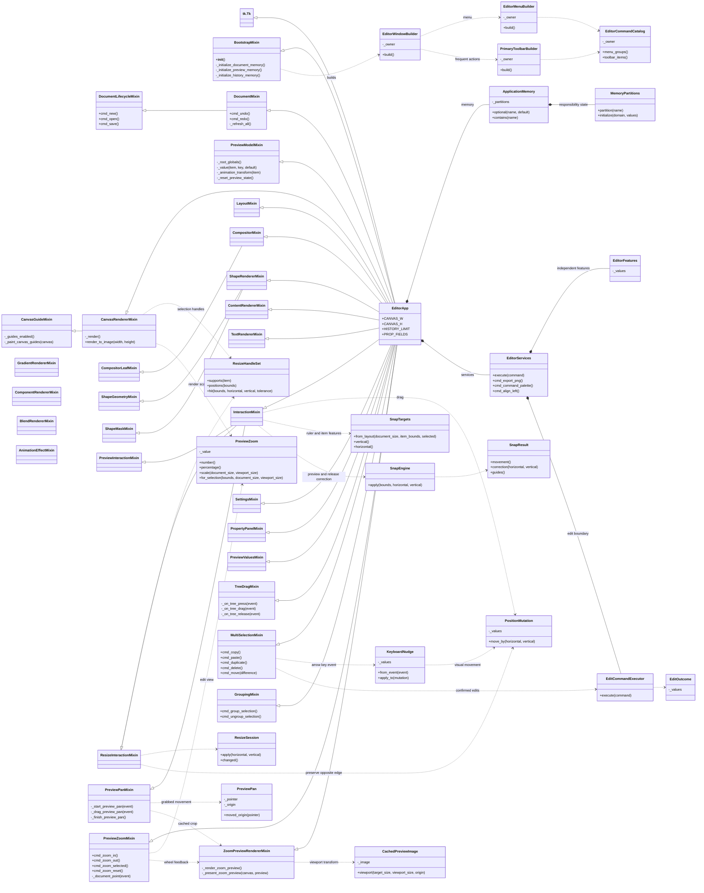
```mermaid
classDiagram
    direction LR

    class TkRoot["tk.Tk"]
    class EditorApp {
        +CANVAS_W
        +CANVAS_H
        +HISTORY_LIMIT
        +PROP_FIELDS
    }
    class EditorServices {
        +execute(command)
        +cmd_export_png()
        +cmd_command_palette()
        +cmd_align_left()
    }
    class EditorFeatures {
        -_values
    }
    class EditCommandExecutor {
        +execute(command)
    }
    class EditOutcome {
        -_values
    }
    class MemoryPartitions {
        +partition(name)
        +initialize(domain, values)
    }
    class BootstrapMixin {
        +__init__()
        -_initialize_document_memory()
        -_initialize_preview_memory()
        -_initialize_history_memory()
    }
    class DocumentLifecycleMixin {
        +cmd_new()
        +cmd_open()
        +cmd_save()
    }
    class DocumentMixin {
        +cmd_undo()
        +cmd_redo()
        -_refresh_all()
    }
    class PreviewModelMixin {
        -_root_globals()
        -_value(item, key, default)
        -_animation_transform(item)
        -_reset_preview_state()
    }
    class CanvasRendererMixin {
        -_render()
        +render_to_image(width, height)
    }
    class CanvasGuideMixin {
        -_guides_enabled()
        -_paint_canvas_guides(canvas)
    }
    class SnapTargets {
        +from_layout(document_size, item_bounds, selected)
        +vertical()
        +horizontal()
    }
    class SnapEngine {
        +apply(bounds, horizontal, vertical)
    }
    class SnapResult {
        +movement()
        +correction(horizontal, vertical)
        +guides()
    }
    class ZoomPreviewRendererMixin {
        -_render_zoom_preview()
        -_present_zoom_preview(canvas, preview)
    }
    class LayoutMixin
    class CompositorLeafMixin
    class CompositorMixin
    class ShapeGeometryMixin
    class ShapeMaskMixin
    class GradientRendererMixin
    class ComponentRendererMixin
    class BlendRendererMixin
    class AnimationEffectMixin
    class ShapeRendererMixin
    class ContentRendererMixin
    class TextRendererMixin
    class PreviewInteractionMixin
    class ResizeInteractionMixin
    class PreviewPanMixin {
        -_start_preview_pan(event)
        -_drag_preview_pan(event)
        -_finish_preview_pan()
    }
    class InteractionMixin
    class ResizeHandleSet {
        +supports(item)
        +positions(bounds)
        +hit(bounds, horizontal, vertical, tolerance)
    }
    class ResizeSession {
        +apply(horizontal, vertical)
        +changed()
    }
    class PositionMutation {
        -_values
        +move_by(horizontal, vertical)
    }
    class KeyboardNudge {
        -_values
        +from_event(event)
        +apply_to(mutation)
    }
    class SettingsMixin
    class PropertyPanelMixin
    class PreviewValuesMixin
    class TreeDragMixin {
        -_on_tree_press(event)
        -_on_tree_drag(event)
        -_on_tree_release(event)
    }
    class MultiSelectionMixin {
        +cmd_copy()
        +cmd_paste()
        +cmd_duplicate()
        +cmd_delete()
        +cmd_move(difference)
    }
    class GroupingMixin {
        +cmd_group_selection()
        +cmd_ungroup_selection()
    }
    class PreviewZoomMixin {
        +cmd_zoom_in()
        +cmd_zoom_out()
        +cmd_zoom_selected()
        +cmd_zoom_reset()
        -_document_point(event)
    }
    class PreviewZoom {
        -_value
        +number()
        +percentage()
        +scale(document_size, viewport_size)
        +for_selection(bounds, document_size, viewport_size)
    }
    class CachedPreviewImage {
        -_image
        +viewport(target_size, viewport_size, origin)
    }
    class PreviewPan {
        -_pointer
        -_origin
        +moved_origin(pointer)
    }
    class ApplicationMemory {
        -_partitions
        +optional(name, default)
        +contains(name)
    }
    class EditorWindowBuilder {
        -_owner
        +build()
    }
    class EditorCommandCatalog {
        -_owner
        +menu_groups()
        +toolbar_items()
    }
    class EditorMenuBuilder {
        -_owner
        +build()
    }
    class PrimaryToolbarBuilder {
        -_owner
        +build()
    }

    TkRoot <|-- EditorApp
    BootstrapMixin <|-- EditorApp
    DocumentLifecycleMixin <|-- DocumentMixin
    DocumentMixin <|-- EditorApp
    PreviewModelMixin <|-- EditorApp
    CanvasRendererMixin <|-- EditorApp
    CanvasGuideMixin <|-- CanvasRendererMixin
    ZoomPreviewRendererMixin <|-- EditorApp
    LayoutMixin <|-- EditorApp
    CompositorMixin <|-- EditorApp
    ShapeRendererMixin <|-- EditorApp
    ContentRendererMixin <|-- EditorApp
    TextRendererMixin <|-- EditorApp
    InteractionMixin <|-- EditorApp
    SettingsMixin <|-- EditorApp
    PropertyPanelMixin <|-- EditorApp
    PreviewValuesMixin <|-- EditorApp
    TreeDragMixin <|-- EditorApp
    MultiSelectionMixin <|-- EditorApp
    GroupingMixin <|-- EditorApp
    PreviewZoomMixin <|-- EditorApp

    CompositorLeafMixin <|-- CompositorMixin
    ShapeGeometryMixin <|-- ShapeRendererMixin
    ShapeMaskMixin <|-- ShapeRendererMixin
    PreviewInteractionMixin <|-- InteractionMixin
    ResizeInteractionMixin <|-- InteractionMixin
    PreviewPanMixin <|-- InteractionMixin
    ResizeInteractionMixin ..> ResizeHandleSet
    ResizeInteractionMixin ..> ResizeSession
    InteractionMixin ..> PositionMutation : drag
    InteractionMixin ..> SnapTargets : ruler and item features
    InteractionMixin ..> SnapEngine : preview and release correction
    SnapEngine ..> SnapResult
    ResizeInteractionMixin ..> PositionMutation : preserve opposite edge
    MultiSelectionMixin ..> KeyboardNudge : arrow key event
    KeyboardNudge ..> PositionMutation : visual movement
    MultiSelectionMixin ..> EditCommandExecutor : confirmed edits
    EditCommandExecutor ..> EditOutcome
    CanvasRendererMixin ..> ResizeHandleSet : selection handles
    CanvasRendererMixin ..> PreviewZoom : render scale
    PreviewZoomMixin ..> PreviewZoom : edit view
    ZoomPreviewRendererMixin ..> CachedPreviewImage : viewport transform
    PreviewZoomMixin ..> ZoomPreviewRendererMixin : wheel feedback
    PreviewPanMixin ..> PreviewPan : grabbed movement
    PreviewPanMixin ..> ZoomPreviewRendererMixin : cached crop

    EditorApp *-- ApplicationMemory : memory
    ApplicationMemory *-- MemoryPartitions : responsibility state
    EditorApp *-- EditorServices : services
    EditorServices *-- EditorFeatures : independent features
    EditorServices *-- EditCommandExecutor : edit boundary
    BootstrapMixin ..> EditorWindowBuilder : builds
    EditorWindowBuilder ..> EditorMenuBuilder : menu
    EditorWindowBuilder ..> PrimaryToolbarBuilder : frequent actions
    EditorMenuBuilder ..> EditorCommandCatalog
    PrimaryToolbarBuilder ..> EditorCommandCatalog
```

### 2.2 KLWPアーカイブ、値、履歴

`.klwp` は ZIP として扱われます。`ArchiveContents` は `preset.json`、ビットマップ、フォント、その他エントリー、ファイル位置をひとまとめにしたファーストクラスコレクションです。

画像エントリー名は `bitmaps/IMG` にUUIDの32桁hexを続けます。ZIPエントリーにはKLWP実機と同じUTF-8・data descriptorフラグ `0x808` を設定します。旧版で生成された28桁IDは、`BitmapReferenceNormalizer` が画像名と `preset.json` 内の参照を同時に32桁へ移行します。

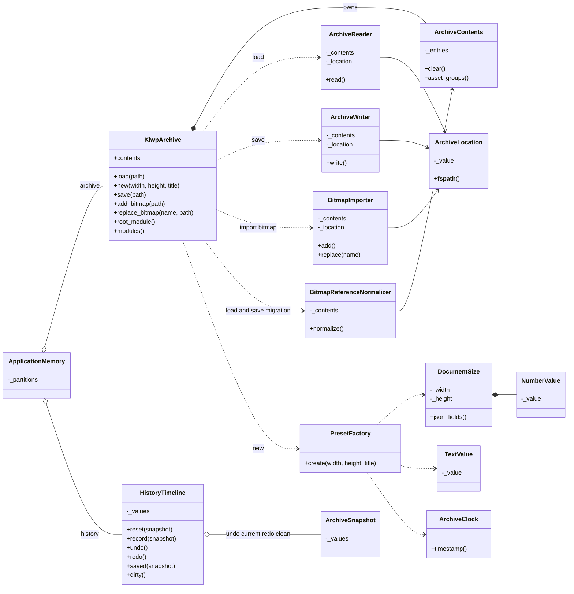
```mermaid
classDiagram
    direction LR

    class ApplicationMemory {
        -_partitions
    }
    class KlwpArchive {
        +contents
        +load(path)
        +new(width, height, title)
        +save(path)
        +add_bitmap(path)
        +replace_bitmap(name, path)
        +root_module()
        +modules()
    }
    class ArchiveContents {
        -_entries
        +clear()
        +asset_groups()
    }
    class ArchiveReader {
        -_contents
        -_location
        +read()
    }
    class ArchiveWriter {
        -_contents
        -_location
        +write()
    }
    class BitmapImporter {
        -_contents
        -_location
        +add()
        +replace(name)
    }
    class BitmapReferenceNormalizer {
        -_contents
        +normalize()
    }
    class PresetFactory {
        +create(width, height, title)
    }
    class ArchiveClock {
        +timestamp()
    }
    class ArchiveLocation {
        -_value
        +__fspath__()
    }
    class DocumentSize {
        -_width
        -_height
        +json_fields()
    }
    class NumberValue {
        -_value
    }
    class TextValue {
        -_value
    }
    class HistoryTimeline {
        -_values
        +reset(snapshot)
        +record(snapshot)
        +undo()
        +redo()
        +saved(snapshot)
        +dirty()
    }
    class ArchiveSnapshot {
        -_values
    }

    ApplicationMemory o-- KlwpArchive : archive
    ApplicationMemory o-- HistoryTimeline : history
    KlwpArchive *-- ArchiveContents : owns
    KlwpArchive ..> ArchiveReader : load
    KlwpArchive ..> ArchiveWriter : save
    KlwpArchive ..> BitmapImporter : import bitmap
    KlwpArchive ..> BitmapReferenceNormalizer : load and save migration
    KlwpArchive ..> PresetFactory : new
    ArchiveReader --> ArchiveLocation
    ArchiveWriter --> ArchiveLocation
    BitmapImporter --> ArchiveLocation
    BitmapReferenceNormalizer --> ArchiveContents
    PresetFactory ..> DocumentSize
    PresetFactory ..> TextValue
    PresetFactory ..> ArchiveClock
    DocumentSize *-- NumberValue
    HistoryTimeline o-- ArchiveSnapshot : undo current redo clean
```

### 2.3 描画パイプライン

`CanvasRendererMixin` が描画全体を開始し、`CompositorMixin` がモジュールツリーを再帰的に合成します。値解決、アニメーション、配置計算を行った後、モジュール種別ごとのレンダラーへ振り分けます。ルート要素の `position_offset_x/y` はアンカーからの距離であり、左上からの絶対座標ではありません。Overlap/Stack内の子要素は四辺の `position_padding_*` を余白として配置し、端アンカーは対応する辺、中央系アンカーは両側余白の差の半分を使用します。アンカー未指定時はCENTER（中央）として扱います。

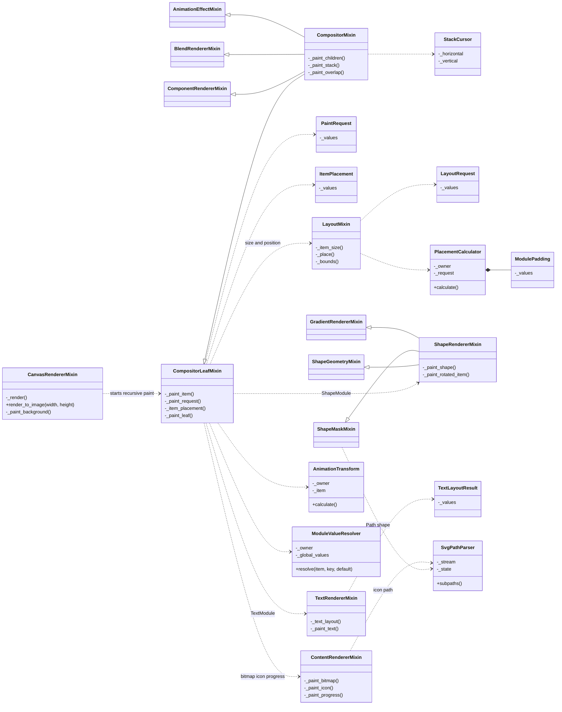
```mermaid
classDiagram
    direction LR

    class CanvasRendererMixin {
        -_render()
        +render_to_image(width, height)
        -_paint_background()
    }
    class CompositorLeafMixin {
        -_paint_item()
        -_paint_request()
        -_item_placement()
        -_paint_leaf()
    }
    class CompositorMixin {
        -_paint_children()
        -_paint_stack()
        -_paint_overlap()
    }
    class PaintRequest {
        -_values
    }
    class ItemPlacement {
        -_values
    }
    class StackCursor {
        -_horizontal
        -_vertical
    }
    class LayoutMixin {
        -_item_size()
        -_place()
        -_bounds()
    }
    class LayoutRequest {
        -_values
    }
    class PlacementCalculator {
        -_owner
        -_request
        +calculate()
    }
    class ModulePadding {
        -_values
    }
    class ShapeRendererMixin {
        -_paint_shape()
        -_paint_rotated_item()
    }
    class ShapeGeometryMixin
    class ShapeMaskMixin
    class TextRendererMixin {
        -_text_layout()
        -_paint_text()
    }
    class TextLayoutResult {
        -_values
    }
    class ContentRendererMixin {
        -_paint_bitmap()
        -_paint_icon()
        -_paint_progress()
    }
    class AnimationTransform {
        -_owner
        -_item
        +calculate()
    }
    class ModuleValueResolver {
        -_owner
        -_global_values
        +resolve(item, key, default)
    }
    class SvgPathParser {
        -_stream
        -_state
        +subpaths()
    }

    CanvasRendererMixin ..> CompositorLeafMixin : starts recursive paint
    CompositorLeafMixin <|-- CompositorMixin
    ComponentRendererMixin <|-- CompositorMixin
    BlendRendererMixin <|-- CompositorMixin
    AnimationEffectMixin <|-- CompositorMixin
    CompositorLeafMixin ..> PaintRequest
    CompositorLeafMixin ..> ItemPlacement
    CompositorMixin ..> StackCursor
    CompositorLeafMixin ..> LayoutMixin : size and position
    LayoutMixin ..> LayoutRequest
    LayoutMixin ..> PlacementCalculator
    PlacementCalculator *-- ModulePadding
    CompositorLeafMixin ..> AnimationTransform
    CompositorLeafMixin ..> ModuleValueResolver
    CompositorLeafMixin ..> ShapeRendererMixin : ShapeModule
    CompositorLeafMixin ..> TextRendererMixin : TextModule
    CompositorLeafMixin ..> ContentRendererMixin : bitmap icon progress
    ShapeGeometryMixin <|-- ShapeRendererMixin
    ShapeMaskMixin <|-- ShapeRendererMixin
    GradientRendererMixin <|-- ShapeRendererMixin
    TextRendererMixin ..> TextLayoutResult
    ShapeMaskMixin ..> SvgPathParser : Path shape
    ContentRendererMixin ..> SvgPathParser : icon path
```

### 2.4 プレビュー、アニメーション、Kode数式

現在ページ、スイッチの目標値と補間値、ループ開始時刻、タップ領域などのプレビュー状態は KLWP アーカイブへ保存されず、`ApplicationMemory` 内だけに存在します。一方、総ページ数は壁紙設定の一部として `preset_info.xscreens` に「総ページ数−1」を保存します。

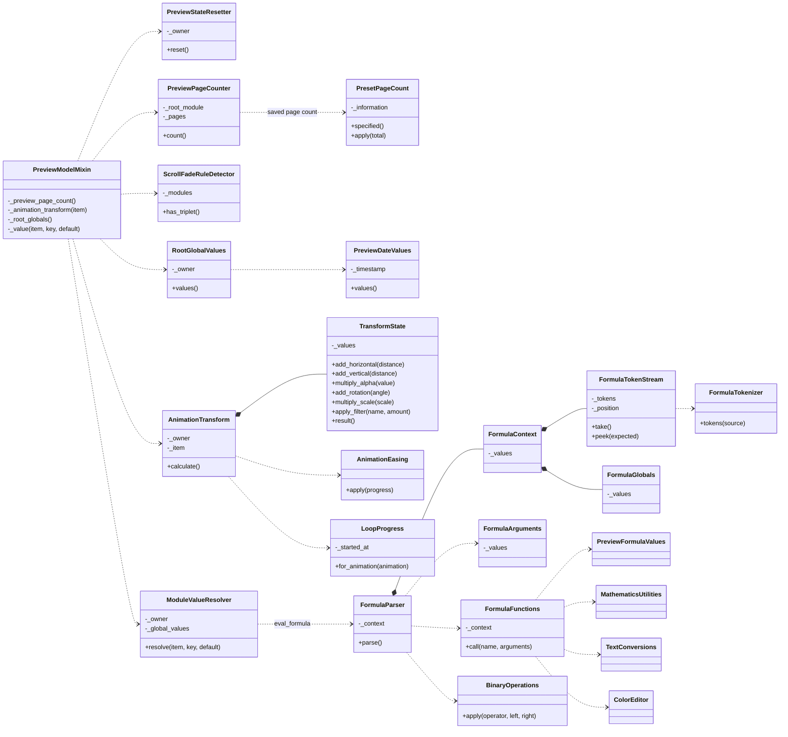
```mermaid
classDiagram
    direction LR

    class PreviewModelMixin {
        -_preview_page_count()
        -_animation_transform(item)
        -_root_globals()
        -_value(item, key, default)
    }
    class PreviewStateResetter {
        -_owner
        +reset()
    }
    class PreviewPageCounter {
        -_root_module
        -_pages
        +count()
    }
    class PresetPageCount {
        -_information
        +specified()
        +apply(total)
    }
    class ScrollFadeRuleDetector {
        -_modules
        +has_triplet()
    }
    class RootGlobalValues {
        -_owner
        +values()
    }
    class PreviewDateValues {
        -_timestamp
        +values()
    }
    class ModuleValueResolver {
        -_owner
        -_global_values
        +resolve(item, key, default)
    }
    class AnimationTransform {
        -_owner
        -_item
        +calculate()
    }
    class TransformState {
        -_values
        +add_horizontal(distance)
        +add_vertical(distance)
        +multiply_alpha(value)
        +add_rotation(angle)
        +multiply_scale(scale)
        +apply_filter(name, amount)
        +result()
    }
    class AnimationEasing {
        +apply(progress)
    }
    class LoopProgress {
        -_started_at
        +for_animation(animation)
    }
    class FormulaParser {
        -_context
        +parse()
    }
    class FormulaContext {
        -_values
    }
    class FormulaTokenStream {
        -_tokens
        -_position
        +take()
        +peek(expected)
    }
    class FormulaTokenizer {
        +tokens(source)
    }
    class FormulaGlobals {
        -_values
    }
    class FormulaArguments {
        -_values
    }
    class FormulaFunctions {
        -_context
        +call(name, arguments)
    }
    class BinaryOperations {
        +apply(operator, left, right)
    }
    class PreviewFormulaValues
    class MathematicsUtilities
    class TextConversions
    class ColorEditor

    PreviewModelMixin ..> PreviewStateResetter
    PreviewModelMixin ..> PreviewPageCounter
    PreviewPageCounter ..> PresetPageCount : saved page count
    PreviewModelMixin ..> ScrollFadeRuleDetector
    PreviewModelMixin ..> RootGlobalValues
    PreviewModelMixin ..> ModuleValueResolver
    PreviewModelMixin ..> AnimationTransform
    RootGlobalValues ..> PreviewDateValues
    AnimationTransform *-- TransformState
    AnimationTransform ..> LoopProgress
    AnimationTransform ..> AnimationEasing
    ModuleValueResolver ..> FormulaParser : eval_formula
    FormulaParser *-- FormulaContext
    FormulaContext *-- FormulaTokenStream
    FormulaContext *-- FormulaGlobals
    FormulaTokenStream ..> FormulaTokenizer
    FormulaParser ..> FormulaArguments
    FormulaParser ..> FormulaFunctions
    FormulaParser ..> BinaryOperations
    FormulaFunctions ..> PreviewFormulaValues
    FormulaFunctions ..> MathematicsUtilities
    FormulaFunctions ..> TextConversions
    FormulaFunctions ..> ColorEditor
```

### 2.5 UIの協調クラス

UI クラスは `EditorApp` を owner として受け取り、処理が確定した時点で `DocumentMixin` または `PropertyPanelMixin` の更新処理へ戻します。

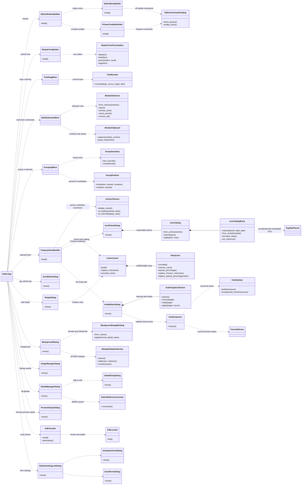
```mermaid
classDiagram
    direction LR

    class EditorApp
    class EditorWindowBuilder {
        +build()
    }
    class EditorCommandCatalog {
        +menu_groups()
        +toolbar_items()
    }
    class EditorMenuBuilder {
        +build()
    }
    class PrimaryToolbarBuilder {
        +build()
    }
    class ModuleTreeBuilder {
        +build()
    }
    class ModuleTreePresentation {
        +title(item)
        +kind(item)
        +priority(index, count)
        +tags(item)
    }
    class TreeDragMixin
    class TreeReorder {
        +move(siblings, source, target, after)
    }
    class ModuleSelection {
        +from_memory(memory)
        +items()
        +primary_item()
        +same_parent()
        +remove_all()
    }
    class ModuleClipboard {
        +capture(modules, archive)
        +paste_into(archive)
    }
    class GroupGeometry {
        +item_bounds()
        +union(bounds)
    }
    class GroupPosition {
        +inside(item, bounds, container)
        +root(item, bounds)
    }
    class PropertyPanelBuilder {
        +build()
    }
    class AnchorChoices {
        +display_values()
        +to_display(internal_value)
        +to_internal(display_value)
    }
    class ColorControl {
        +build()
        +replace_color(value)
        +encoded_color()
    }
    class KlwpColor {
        +encoded()
        +chooser_color()
        +opacity_percentage()
        +replace_chooser_color(value)
        +replace_opacity_percentage(value)
    }
    class JsonEditorDialog {
        +show()
    }
    class IconPickerDialog {
        +show()
    }
    class IconCatalog {
        +from_archive(archive)
        +search(query)
        +apply(item, entry)
    }
    class IconCatalogEntry {
        +material(name, label, path)
        +from_module(module)
        +encoded_value()
        +set_reference()
    }
    class KodeEditorDialog {
        +show()
    }
    class KodeTargetCollection {
        +names()
        +source(target)
        +valid(target)
        +apply(target, source)
    }
    class KodeInspector {
        +inspect()
    }
    class KodeSyntax {
        +problem(source)
        +unsupported_functions(source)
    }
    class ShapeDialog {
        +show()
    }
    class BackgroundDialog {
        +show()
    }
    class BackgroundImageBinding {
        +form_values()
        +apply(formula, global_name)
    }
    class BitmapGlobalCollection {
        +names()
        +add(name, reference)
        +contains(name)
    }
    class ImageManagerDialog {
        +show()
    }
    class GlobalManagerDialog {
        +show()
    }
    class GlobalEntryDialog {
        +show()
    }
    class PreviewValuesDialog {
        +show()
    }
    class AdbTransfer {
        +send()
        +destination()
    }
    class AdbLocator {
        +find()
    }
    class ModuleSettingListDialog {
        +show()
    }
    class AnimationFormDialog {
        +show()
    }
    class EventFormDialog {
        +show()
    }
    class SwitchReferenceCounter {
        +count(value)
    }

    EditorApp ..> EditorWindowBuilder : startup
    EditorWindowBuilder ..> EditorMenuBuilder : native menu
    EditorWindowBuilder ..> PrimaryToolbarBuilder : compact toolbar
    EditorMenuBuilder ..> EditorCommandCatalog : all toolbar commands
    PrimaryToolbarBuilder ..> EditorCommandCatalog : frequent commands
    EditorApp ..> ModuleTreeBuilder : refresh tree
    ModuleTreeBuilder ..> ModuleTreePresentation : row values
    EditorApp ..> TreeDragMixin : layer ordering
    TreeDragMixin ..> TreeReorder : commit drop
    EditorApp ..> MultiSelectionMixin : multi item commands
    MultiSelectionMixin ..> ModuleSelection : selected rows
    MultiSelectionMixin ..> ModuleClipboard : modules and assets
    EditorApp ..> GroupingMixin : group or dissolve
    GroupingMixin ..> GroupGeometry : visual union
    GroupingMixin ..> GroupPosition : preserve coordinates
    EditorApp ..> PropertyPanelBuilder : selected item
    PropertyPanelBuilder ..> AnchorChoices : anchor combobox conversion
    PropertyPanelBuilder ..> ColorControl : visual color editing
    ShapeDialog ..> ColorControl : creation color
    ColorControl *-- KlwpColor : AARRGGBB value
    EditorApp ..> JsonEditorDialog : raw JSON edit
    PropertyPanelBuilder ..> IconPickerDialog : FontIcon selection
    IconPickerDialog *-- IconCatalog : searchable entries
    IconCatalog *-- IconCatalogEntry
    IconCatalogEntry ..> SvgPathParser : encode/decode embedded SVG
    PropertyPanelBuilder ..> KodeEditorDialog : live Kode edit
    KodeEditorDialog *-- KodeTargetCollection : selected item fields
    KodeEditorDialog ..> KodeInspector : validate and preview
    KodeInspector ..> KodeSyntax : structural check
    KodeInspector ..> FormulaParser : current preview values
    EditorApp ..> ShapeDialog : add shape
    EditorApp ..> BackgroundDialog : background
    BackgroundDialog ..> BackgroundImageBinding : formula and Global link
    BackgroundDialog ..> BitmapGlobalCollection : BITMAP Globals
    EditorApp ..> ImageManagerDialog : bitmap assets
    EditorApp ..> GlobalManagerDialog : all globals
    GlobalManagerDialog ..> GlobalEntryDialog : add or edit
    EditorApp ..> PreviewValuesDialog : formula preview inputs
    EditorApp ..> AdbTransfer : push preset
    AdbTransfer ..> AdbLocator : locate executable
    EditorApp ..> ModuleSettingListDialog : item settings
    ModuleSettingListDialog ..> AnimationFormDialog
    ModuleSettingListDialog ..> EventFormDialog
    GlobalManagerDialog ..> SwitchReferenceCounter : deletion guard
```

## 3. シーケンス図

### 3.1 アプリケーション起動

起動時は空の KLWP プリセットを生成し、UI 構築後にプレビュー状態と履歴を初期化して、最初の画面を描画します。

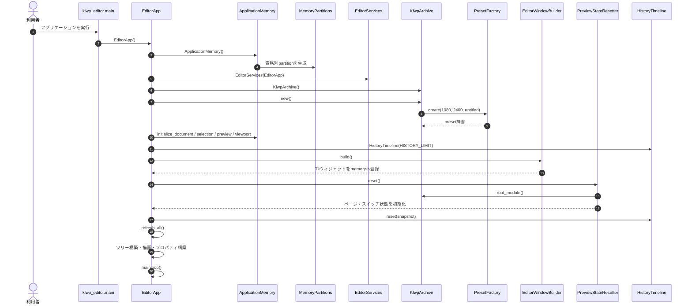
```mermaid
sequenceDiagram
    autonumber
    actor User as 利用者
    participant Main as klwp_editor.main
    participant Editor as EditorApp
    participant Memory as ApplicationMemory
    participant Partitions as MemoryPartitions
    participant Services as EditorServices
    participant Archive as KlwpArchive
    participant Factory as PresetFactory
    participant Window as EditorWindowBuilder
    participant Preview as PreviewStateResetter
    participant History as HistoryTimeline

    User->>Main: アプリケーションを実行
    Main->>Editor: EditorApp()
    Editor->>Memory: ApplicationMemory()
    Memory->>Partitions: 責務別partitionを生成
    Editor->>Services: EditorServices(EditorApp)
    Editor->>Archive: KlwpArchive()
    Editor->>Archive: new()
    Archive->>Factory: create(1080, 2400, untitled)
    Factory-->>Archive: preset辞書
    Editor->>Memory: initialize_document / selection / preview / viewport
    Editor->>History: HistoryTimeline(HISTORY_LIMIT)
    Editor->>Window: build()
    Window-->>Editor: Tkウィジェットをmemoryへ登録
    Editor->>Preview: reset()
    Preview->>Archive: root_module()
    Preview-->>Editor: ページ・スイッチ状態を初期化
    Editor->>History: reset(snapshot)
    Editor->>Editor: _refresh_all()
    Editor->>Editor: ツリー構築・描画・プロパティ構築
    Editor->>Editor: mainloop()
```

### 3.2 KLWPファイルを開いて描画する

読込後の描画では、最上位モジュールごとに値解決、アニメーション変換、配置、種別別描画、子要素の再帰処理を実行します。

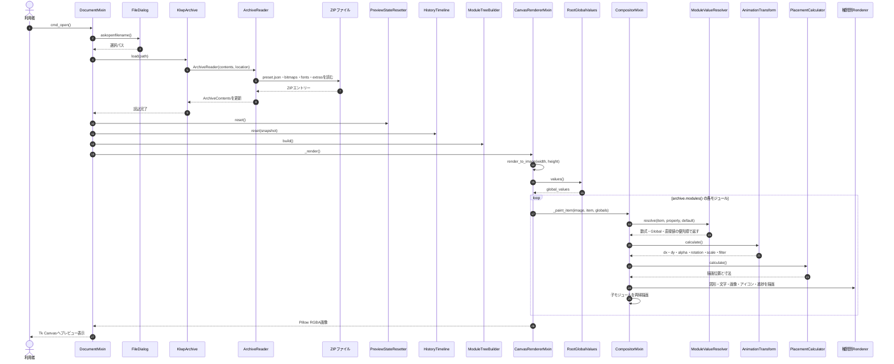
```mermaid
sequenceDiagram
    autonumber
    actor User as 利用者
    participant Document as DocumentMixin
    participant Dialog as FileDialog
    participant Archive as KlwpArchive
    participant Reader as ArchiveReader
    participant Zip as ZIPファイル
    participant Preview as PreviewStateResetter
    participant History as HistoryTimeline
    participant Tree as ModuleTreeBuilder
    participant Canvas as CanvasRendererMixin
    participant Globals as RootGlobalValues
    participant Composite as CompositorMixin
    participant Values as ModuleValueResolver
    participant Animation as AnimationTransform
    participant Placement as PlacementCalculator
    participant Renderer as 種別別Renderer

    User->>Document: cmd_open()
    Document->>Dialog: askopenfilename()
    Dialog-->>Document: 選択パス
    Document->>Archive: load(path)
    Archive->>Reader: ArchiveReader(contents, location)
    Reader->>Zip: preset.json・bitmaps・fonts・extrasを読む
    Zip-->>Reader: ZIPエントリー
    Reader-->>Archive: ArchiveContentsを更新
    Archive-->>Document: 読込完了
    Document->>Preview: reset()
    Document->>History: reset(snapshot)
    Document->>Tree: build()
    Document->>Canvas: _render()
    Canvas->>Canvas: render_to_image(width, height)
    Canvas->>Globals: values()
    Globals-->>Canvas: global_values

    loop archive.modules() の各モジュール
        Canvas->>Composite: _paint_item(image, item, globals)
        Composite->>Values: resolve(item, property, default)
        Values-->>Composite: 数式・Global・直接値の優先順で返す
        Composite->>Animation: calculate()
        Animation-->>Composite: dx・dy・alpha・rotation・scale・filter
        Composite->>Placement: calculate()
        Placement-->>Composite: 描画位置と寸法
        Composite->>Renderer: 図形・文字・画像・アイコン・進捗を描画
        Composite->>Composite: 子モジュールを再帰描画
    end

    Canvas-->>Document: Pillow RGBA画像
    Document-->>User: Tk Canvasへプレビュー表示
```

### 3.3 プロパティ編集とUndo／Redo

履歴には差分ではなく、KLWP アーカイブのスナップショットを保存します。保存時点のスナップショットを `clean` とし、現在値との差で未保存状態を判定します。

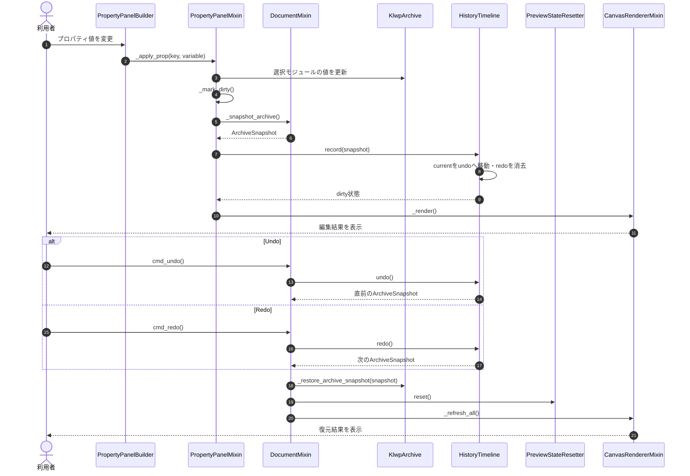
```mermaid
sequenceDiagram
    autonumber
    actor User as 利用者
    participant Panel as PropertyPanelBuilder
    participant Property as PropertyPanelMixin
    participant Document as DocumentMixin
    participant Archive as KlwpArchive
    participant History as HistoryTimeline
    participant Preview as PreviewStateResetter
    participant Canvas as CanvasRendererMixin

    User->>Panel: プロパティ値を変更
    Panel->>Property: _apply_prop(key, variable)
    Property->>Archive: 選択モジュールの値を更新
    Property->>Property: _mark_dirty()
    Property->>Document: _snapshot_archive()
    Document-->>Property: ArchiveSnapshot
    Property->>History: record(snapshot)
    History->>History: currentをundoへ移動・redoを消去
    History-->>Property: dirty状態
    Property->>Canvas: _render()
    Canvas-->>User: 編集結果を表示

    alt Undo
        User->>Document: cmd_undo()
        Document->>History: undo()
        History-->>Document: 直前のArchiveSnapshot
    else Redo
        User->>Document: cmd_redo()
        Document->>History: redo()
        History-->>Document: 次のArchiveSnapshot
    end

    Document->>Archive: _restore_archive_snapshot(snapshot)
    Document->>Preview: reset()
    Document->>Canvas: _refresh_all()
    Canvas-->>User: 復元結果を表示
```

### 3.4 保存処理

`ArchiveWriter` は現在の `ArchiveContents` から `preset.json` とアセット群を ZIP 圧縮し、`.klwp` として書き出します。

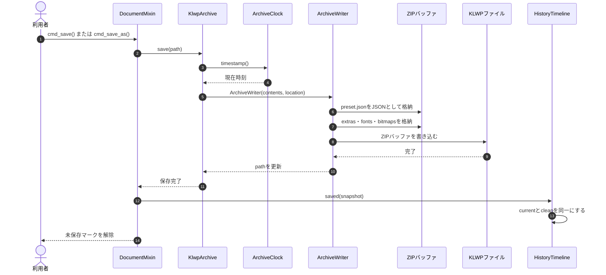
```mermaid
sequenceDiagram
    autonumber
    actor User as 利用者
    participant Document as DocumentMixin
    participant Archive as KlwpArchive
    participant Clock as ArchiveClock
    participant Writer as ArchiveWriter
    participant Zip as ZIPバッファ
    participant File as KLWPファイル
    participant History as HistoryTimeline

    User->>Document: cmd_save() または cmd_save_as()
    Document->>Archive: save(path)
    Archive->>Clock: timestamp()
    Clock-->>Archive: 現在時刻
    Archive->>Writer: ArchiveWriter(contents, location)
    Writer->>Zip: preset.jsonをJSONとして格納
    Writer->>Zip: extras・fonts・bitmapsを格納
    Writer->>File: ZIPバッファを書き込む
    File-->>Writer: 完了
    Writer-->>Archive: pathを更新
    Archive-->>Document: 保存完了
    Document->>History: saved(snapshot)
    History->>History: currentとcleanを同一にする
    Document-->>User: 未保存マークを解除
```

### 3.5 タップによるスイッチアニメーション

描画時に `internal_events` を持つモジュールの領域を登録します。操作プレビューモードでタップすると、該当領域のイベントを実行し、スイッチ値を 300ms で補間します。Android アプリ起動など外部アクションはステータス表示だけで終了します。

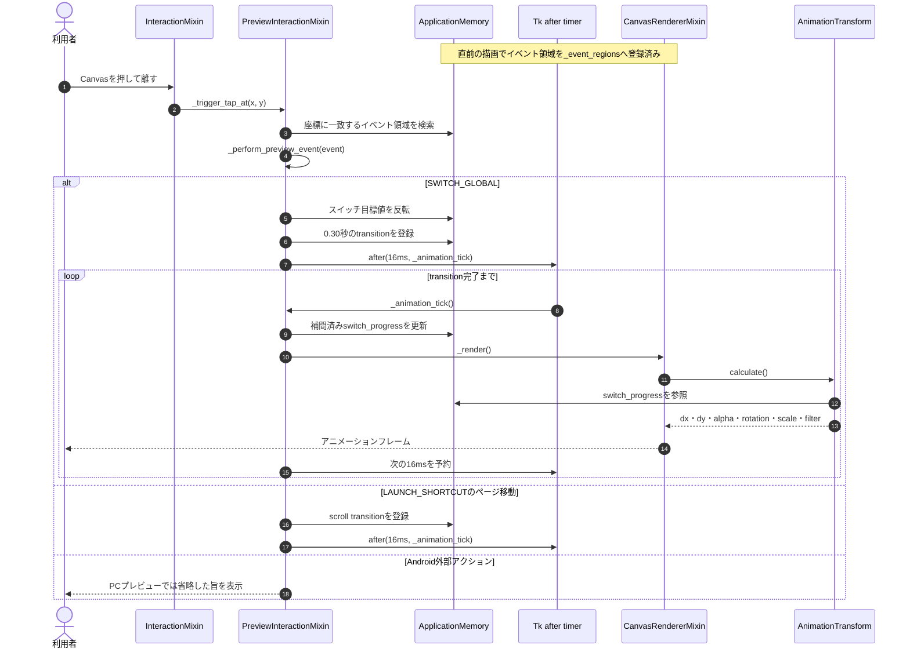
```mermaid
sequenceDiagram
    autonumber
    actor User as 利用者
    participant Interaction as InteractionMixin
    participant Events as PreviewInteractionMixin
    participant Memory as ApplicationMemory
    participant Timer as Tk after timer
    participant Canvas as CanvasRendererMixin
    participant Transform as AnimationTransform

    Note over Canvas,Memory: 直前の描画でイベント領域を_event_regionsへ登録済み
    User->>Interaction: Canvasを押して離す
    Interaction->>Events: _trigger_tap_at(x, y)
    Events->>Memory: 座標に一致するイベント領域を検索
    Events->>Events: _perform_preview_event(event)

    alt SWITCH_GLOBAL
        Events->>Memory: スイッチ目標値を反転
        Events->>Memory: 0.30秒のtransitionを登録
        Events->>Timer: after(16ms, _animation_tick)
        loop transition完了まで
            Timer->>Events: _animation_tick()
            Events->>Memory: 補間済みswitch_progressを更新
            Events->>Canvas: _render()
            Canvas->>Transform: calculate()
            Transform->>Memory: switch_progressを参照
            Transform-->>Canvas: dx・dy・alpha・rotation・scale・filter
            Canvas-->>User: アニメーションフレーム
            Events->>Timer: 次の16msを予約
        end
    else LAUNCH_SHORTCUTのページ移動
        Events->>Memory: scroll transitionを登録
        Events->>Timer: after(16ms, _animation_tick)
    else Android外部アクション
        Events-->>User: PCプレビューでは省略した旨を表示
    end
```

### 3.6 横スワイプによるページ追従

ドラッグ中はポインタ移動量を Canvas 幅で割って連続的なページ位置へ変換します。指を離した後は最寄りページへ 250ms でスムーズに吸着します。「総数…」では1～99の総ページ数を指定でき、`PresetPageCount` がKLWPの `xscreens = 総ページ数 - 1` へ変換して保存します。保存値が存在するプリセットではその値を優先し、旧形式など保存値がない場合だけアニメーションとページ移動イベントから推定します。ページ数を現在位置より小さくした場合は、新しい最終ページへプレビュー位置を補正します。

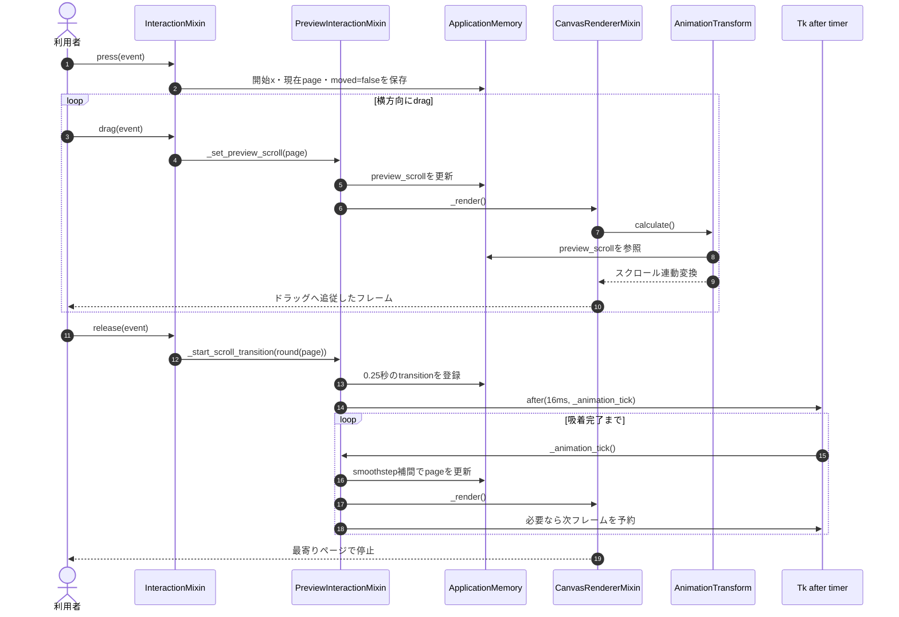
```mermaid
sequenceDiagram
    autonumber
    actor User as 利用者
    participant Interaction as InteractionMixin
    participant Preview as PreviewInteractionMixin
    participant Memory as ApplicationMemory
    participant Canvas as CanvasRendererMixin
    participant Transform as AnimationTransform
    participant Timer as Tk after timer

    User->>Interaction: press(event)
    Interaction->>Memory: 開始x・現在page・moved=falseを保存
    loop 横方向にdrag
        User->>Interaction: drag(event)
        Interaction->>Preview: _set_preview_scroll(page)
        Preview->>Memory: preview_scrollを更新
        Preview->>Canvas: _render()
        Canvas->>Transform: calculate()
        Transform->>Memory: preview_scrollを参照
        Transform-->>Canvas: スクロール連動変換
        Canvas-->>User: ドラッグへ追従したフレーム
    end
    User->>Interaction: release(event)
    Interaction->>Preview: _start_scroll_transition(round(page))
    Preview->>Memory: 0.25秒のtransitionを登録
    Preview->>Timer: after(16ms, _animation_tick)
    loop 吸着完了まで
        Timer->>Preview: _animation_tick()
        Preview->>Memory: smoothstep補間でpageを更新
        Preview->>Canvas: _render()
        Preview->>Timer: 必要なら次フレームを予約
    end
    Canvas-->>User: 最寄りページで停止
```

### 3.7 図形・画像の直接リサイズ

編集対象の選択元は左ペインの要素Treeviewだけです。プレビュー上でアイテムをクリックしても未選択状態から選択せず、別アイテムへも切り替えません。Treeviewで選択済みの要素内部をドラッグした場合だけ座標・余白を変更し、その要素のハンドルをドラッグした場合だけサイズを変更します。アイテムのない背景では拡大表示のパンへ移ります。

編集モードで選択したShapeまたはBitmapには8方向のハンドルを表示します。Shapeはドラッグした軸を個別に変更し、Bitmapはどのハンドルでも現在の縦横比を維持します。サイズ変更後は、ルート要素ならアンカー基準オフセット、レイヤー内の子要素なら四辺余白を補正し、ドラッグしていない反対側の縁を固定します。描画時に全モジュールの境界を記録するため、Treeviewで選択したOverlap内の子要素も直接移動・リサイズできます。

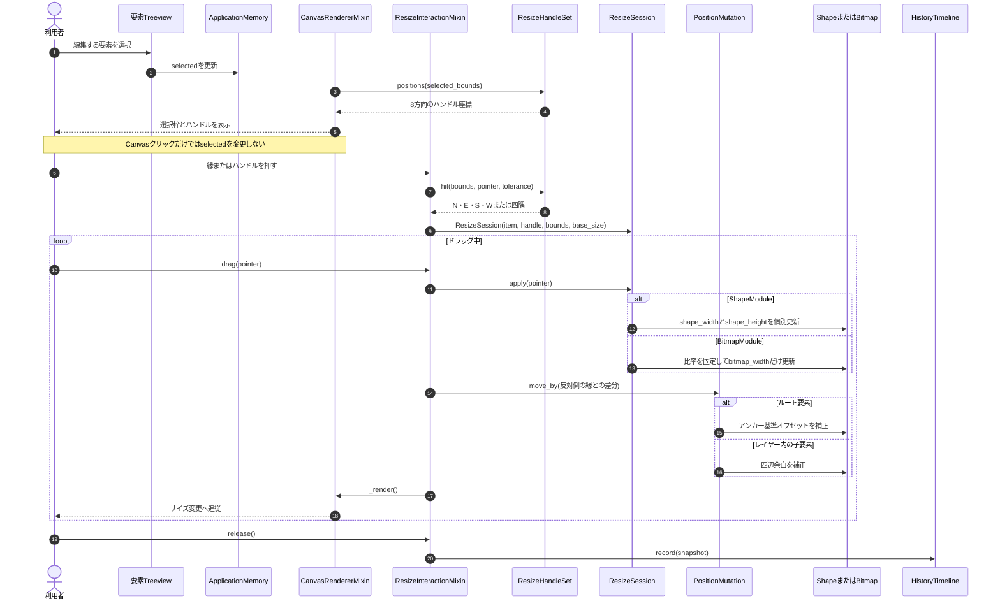
```mermaid
sequenceDiagram
    autonumber
    actor User as 利用者
    participant Tree as 要素Treeview
    participant Memory as ApplicationMemory
    participant Canvas as CanvasRendererMixin
    participant Interaction as ResizeInteractionMixin
    participant Handles as ResizeHandleSet
    participant Session as ResizeSession
    participant Position as PositionMutation
    participant Item as ShapeまたはBitmap
    participant History as HistoryTimeline

    User->>Tree: 編集する要素を選択
    Tree->>Memory: selectedを更新
    Canvas->>Handles: positions(selected_bounds)
    Handles-->>Canvas: 8方向のハンドル座標
    Canvas-->>User: 選択枠とハンドルを表示
    Note over User,Canvas: Canvasクリックだけではselectedを変更しない
    User->>Interaction: 縁またはハンドルを押す
    Interaction->>Handles: hit(bounds, pointer, tolerance)
    Handles-->>Interaction: N・E・S・Wまたは四隅
    Interaction->>Session: ResizeSession(item, handle, bounds, base_size)
    loop ドラッグ中
        User->>Interaction: drag(pointer)
        Interaction->>Session: apply(pointer)
        alt ShapeModule
            Session->>Item: shape_widthとshape_heightを個別更新
        else BitmapModule
            Session->>Item: 比率を固定してbitmap_widthだけ更新
        end
        Interaction->>Position: move_by(反対側の縁との差分)
        alt ルート要素
            Position->>Item: アンカー基準オフセットを補正
        else レイヤー内の子要素
            Position->>Item: 四辺余白を補正
        end
        Interaction->>Canvas: _render()
        Canvas-->>User: サイズ変更へ追従
    end
    User->>Interaction: release()
    Interaction->>History: record(snapshot)
```

### 3.8 ADBによるAndroid端末への転送

転送コマンドは編集中のプリセットを先に保存し、PATHまたはAndroid SDKから`adb`を検出します。接続状態が`device`の端末が1台だけであることを確認してから、KLWPのwallpapersディレクトリを作成し、保存済み`.klwp`を転送します。

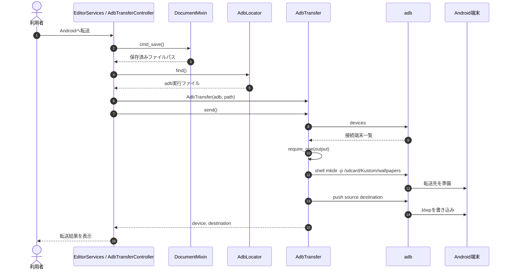
```mermaid
sequenceDiagram
    autonumber
    actor User as 利用者
    participant Editor as EditorServices / AdbTransferController
    participant Document as DocumentMixin
    participant Locator as AdbLocator
    participant Transfer as AdbTransfer
    participant Adb as adb
    participant Android as Android端末

    User->>Editor: Androidへ転送
    Editor->>Document: cmd_save()
    Document-->>Editor: 保存済みファイルパス
    Editor->>Locator: find()
    Locator-->>Editor: adb実行ファイル
    Editor->>Transfer: AdbTransfer(adb, path)
    Editor->>Transfer: send()
    Transfer->>Adb: devices
    Adb-->>Transfer: 接続端末一覧
    Transfer->>Transfer: require_one(output)
    Transfer->>Adb: shell mkdir -p /sdcard/Kustom/wallpapers
    Adb->>Android: 転送先を準備
    Transfer->>Adb: push source destination
    Adb->>Android: .klwpを書き込み
    Transfer-->>Editor: device, destination
    Editor-->>User: 転送結果を表示
```

### 3.9 要素ツリーのドラッグによる表示優先度変更

ツリーはKLWPの配列順と同じく上から背面、下ほど前面として表示します。ドラッグ元とドロップ先が同じ兄弟コレクションに属する場合だけ、対象行の前または後へ移動します。別レイヤーへのドロップは階層構造を変えてしまうため受け付けません。変更はドロップ時に一度だけ履歴へ記録され、Undo/Redoできます。

子要素を持つレイヤーが選択中の場合、新規要素の追加先はそのレイヤーです。「選択解除（ルート）」ボタン、ツリーの空白クリック、またはEscキーで選択を解除すると、`selected` とTreeviewの選択を同時に消去し、以降の追加先をルートの `modules` へ戻します。選択解除自体は成果物を変更しないため履歴には記録しません。

Treeviewにフォーカスがある状態のDeleteキーは `_on_delete_shortcut()` から確認処理を通さず `_delete_target()` を呼び、兄弟コレクションから即時削除して履歴へ記録します。誤操作時はCtrl+Zで復元できます。ツールバーの「削除」は `cmd_delete()` から確認ダイアログを経由する従来動作を維持します。バインド範囲をTreeviewに限定するため、右ペインの文字入力中にDeleteを押してもアイテム削除は発生しません。

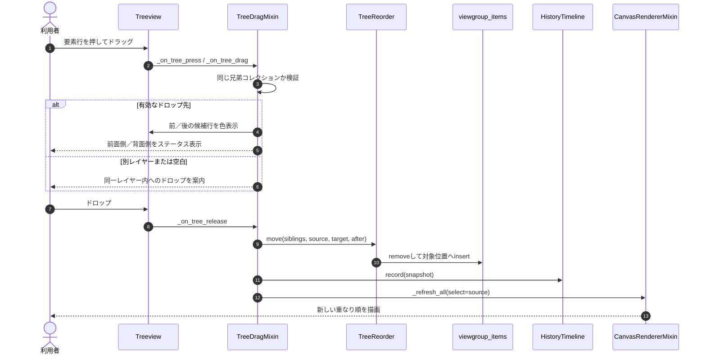
```mermaid
sequenceDiagram
    autonumber
    actor User as 利用者
    participant Tree as Treeview
    participant Drag as TreeDragMixin
    participant Reorder as TreeReorder
    participant Items as viewgroup_items
    participant History as HistoryTimeline
    participant Preview as CanvasRendererMixin

    User->>Tree: 要素行を押してドラッグ
    Tree->>Drag: _on_tree_press / _on_tree_drag
    Drag->>Drag: 同じ兄弟コレクションか検証
    alt 有効なドロップ先
        Drag->>Tree: 前／後の候補行を色表示
        Drag-->>User: 前面側／背面側をステータス表示
    else 別レイヤーまたは空白
        Drag-->>User: 同一レイヤー内へのドロップを案内
    end
    User->>Tree: ドロップ
    Tree->>Drag: _on_tree_release
    Drag->>Reorder: move(siblings, source, target, after)
    Reorder->>Items: removeして対象位置へinsert
    Drag->>History: record(snapshot)
    Drag->>Preview: _refresh_all(select=source)
    Preview-->>User: 新しい重なり順を描画
```

### 3.10 数式・BITMAP Globalによる背景切替

背景設定は固定画像に加え、`internal_globals.background_bitmap` のBITMAP型Globalリンクと、`internal_formulas.background_bitmap` のKode数式を編集します。数式がある場合は数式、次にGlobalリンク、最後に固定の `background_bitmap` という通常の値解決優先順位を使用します。プレビュー値で日時を変更すると `df(H)` などが再評価され、Globalに保存されたアーカイブ内画像パスから背景を再描画します。

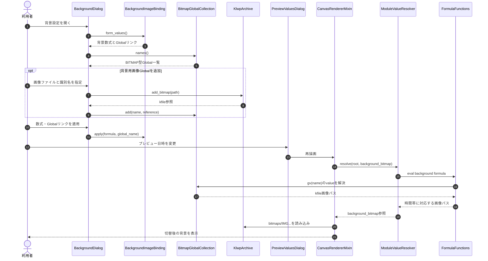
```mermaid
sequenceDiagram
    autonumber
    actor User as 利用者
    participant Dialog as BackgroundDialog
    participant Binding as BackgroundImageBinding
    participant Globals as BitmapGlobalCollection
    participant Archive as KlwpArchive
    participant Preview as PreviewValuesDialog
    participant Canvas as CanvasRendererMixin
    participant Resolver as ModuleValueResolver
    participant Formula as FormulaFunctions

    User->>Dialog: 背景設定を開く
    Dialog->>Binding: form_values()
    Binding-->>Dialog: 背景数式とGlobalリンク
    Dialog->>Globals: names()
    Globals-->>Dialog: BITMAP型Global一覧
    opt 背景用画像Globalを追加
        User->>Dialog: 画像ファイルと識別名を指定
        Dialog->>Archive: add_bitmap(path)
        Archive-->>Dialog: kfile参照
        Dialog->>Globals: add(name, reference)
    end
    User->>Dialog: 数式・Globalリンクを適用
    Dialog->>Binding: apply(formula, global_name)
    User->>Preview: プレビュー日時を変更
    Preview->>Canvas: 再描画
    Canvas->>Resolver: resolve(root, background_bitmap)
    Resolver->>Formula: eval background formula
    Formula->>Globals: gv(name)のvalueを解決
    Globals-->>Formula: kfile画像パス
    Formula-->>Resolver: 時間帯に対応する画像パス
    Resolver-->>Canvas: background_bitmap参照
    Canvas->>Archive: bitmaps/IMG...を読み込み
    Canvas-->>User: 切替後の背景を表示
```

### 3.11 実機スクショとのピクセル差分

PC描画の回帰を目視だけに依存させないため、`PresetPreview`が指定日時・解像度で`.klwp`をヘッドレス描画し、`ComparableImages`が実機スクショと同一RGB解像度で比較します。Androidのステータスバー等は`ComparisonRegion`の四辺マージンで除外できます。

MSEはRGB全チャンネルの画素二乗誤差平均、PSNRはMSEから算出し、SSIMはグレースケール画像全体の平均・分散・共分散によるグローバルSSIMです。`PixelDiffThresholds`は最大MSEと最小SSIMを品質ゲートとして評価します。`PixelDiff.write_report()`は正規化済み正解画像、PC描画、差分ヒートマップ、JSON指標を`artifacts/`へ出力します。

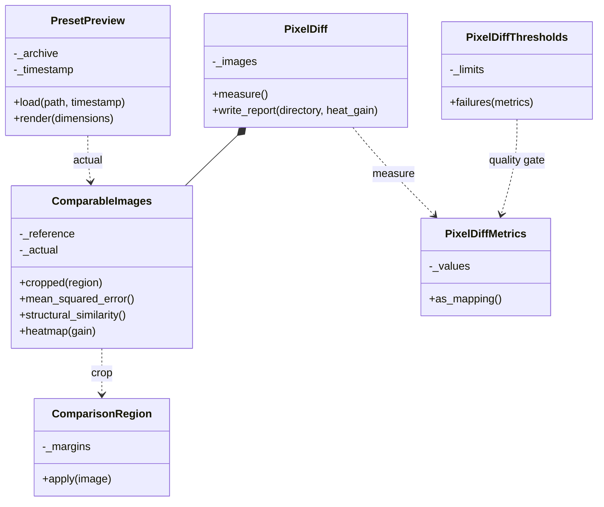
```mermaid
classDiagram
    class ComparisonRegion {
        -_margins
        +apply(image)
    }
    class ComparableImages {
        -_reference
        -_actual
        +cropped(region)
        +mean_squared_error()
        +structural_similarity()
        +heatmap(gain)
    }
    class PixelDiffMetrics {
        -_values
        +as_mapping()
    }
    class PixelDiffThresholds {
        -_limits
        +failures(metrics)
    }
    class PixelDiff {
        -_images
        +measure()
        +write_report(directory, heat_gain)
    }
    class PresetPreview {
        -_archive
        -_timestamp
        +load(path, timestamp)
        +render(dimensions)
    }

    PresetPreview ..> ComparableImages : actual
    ComparableImages ..> ComparisonRegion : crop
    PixelDiff *-- ComparableImages
    PixelDiff ..> PixelDiffMetrics : measure
    PixelDiffThresholds ..> PixelDiffMetrics : quality gate
```

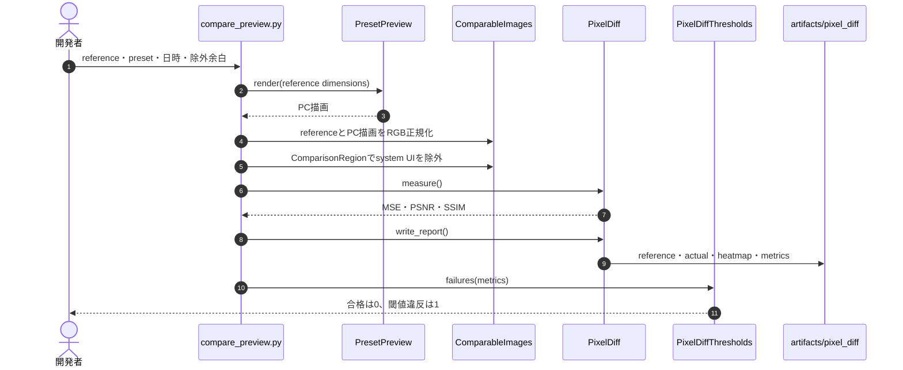
```mermaid
sequenceDiagram
    autonumber
    actor Developer as 開発者
    participant CLI as compare_preview.py
    participant Preview as PresetPreview
    participant Images as ComparableImages
    participant Diff as PixelDiff
    participant Gate as PixelDiffThresholds
    participant Files as artifacts/pixel_diff

    Developer->>CLI: reference・preset・日時・除外余白
    CLI->>Preview: render(reference dimensions)
    Preview-->>CLI: PC描画
    CLI->>Images: referenceとPC描画をRGB正規化
    CLI->>Images: ComparisonRegionでsystem UIを除外
    CLI->>Diff: measure()
    Diff-->>CLI: MSE・PSNR・SSIM
    CLI->>Diff: write_report()
    Diff->>Files: reference・actual・heatmap・metrics
    CLI->>Gate: failures(metrics)
    Gate-->>Developer: 合格は0、閾値違反は1
```

### 3.12 Kode数式のライブ編集

選択要素の `text_expression` と `internal_formulas.<property>` を同じ画面で編集します。入力中は120msのデバウンス後にドル記号・括弧・引用符を検査し、構文が正しければ現在のプレビュー日時・天気・バッテリー等を用いて評価します。PC評価器が未対応の関数はKLWP互換性のため保存を妨げず、警告として表示します。適用時は対象フィールドだけを書き換え、他の未知キーと数式を保持して履歴へ記録します。

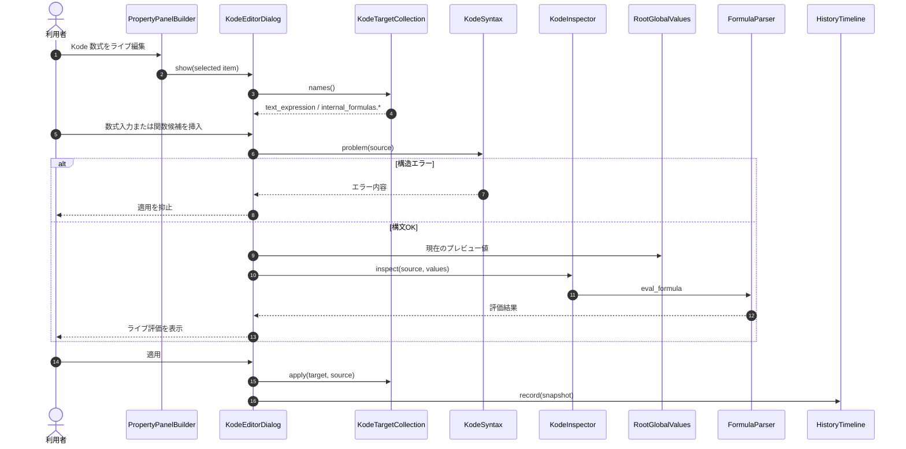
```mermaid
sequenceDiagram
    autonumber
    actor User as 利用者
    participant Panel as PropertyPanelBuilder
    participant Dialog as KodeEditorDialog
    participant Targets as KodeTargetCollection
    participant Syntax as KodeSyntax
    participant Inspector as KodeInspector
    participant Preview as RootGlobalValues
    participant Formula as FormulaParser
    participant History as HistoryTimeline

    User->>Panel: Kode 数式をライブ編集
    Panel->>Dialog: show(selected item)
    Dialog->>Targets: names()
    Targets-->>Dialog: text_expression / internal_formulas.*
    User->>Dialog: 数式入力または関数候補を挿入
    Dialog->>Syntax: problem(source)
    alt 構造エラー
        Syntax-->>Dialog: エラー内容
        Dialog-->>User: 適用を抑止
    else 構文OK
        Dialog->>Preview: 現在のプレビュー値
        Dialog->>Inspector: inspect(source, values)
        Inspector->>Formula: eval_formula
        Formula-->>Dialog: 評価結果
        Dialog-->>User: ライブ評価を表示
    end
    User->>Dialog: 適用
    Dialog->>Targets: apply(target, source)
    Dialog->>History: record(snapshot)
```

### 3.13 FontIconの検索・選択

FontIconは `icon_set` と `icon_icon` の組で保存します。`icon_icon` は名前だけではなく、KLWPがオフラインで読み込めるようSVGをgzip/Base64化した自己完結形式です。ピッカーは内蔵Materialアイコンに加え、現在のプリセットに存在するFontIconを走査してカスタムSVGも候補へ再利用します。選択時はアイコン関連の2フィールドだけを更新し、サイズ・色・数式等は保持します。

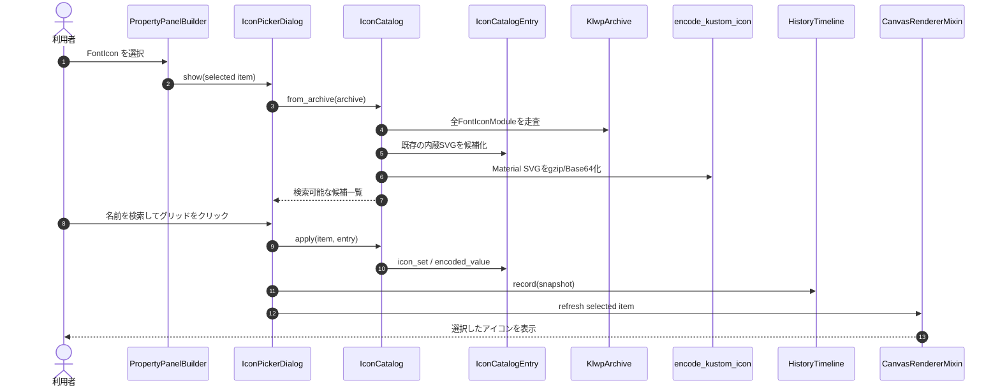
```mermaid
sequenceDiagram
    autonumber
    actor User as 利用者
    participant Panel as PropertyPanelBuilder
    participant Dialog as IconPickerDialog
    participant Catalog as IconCatalog
    participant Entry as IconCatalogEntry
    participant Archive as KlwpArchive
    participant Svg as encode_kustom_icon
    participant History as HistoryTimeline
    participant Preview as CanvasRendererMixin

    User->>Panel: FontIcon を選択
    Panel->>Dialog: show(selected item)
    Dialog->>Catalog: from_archive(archive)
    Catalog->>Archive: 全FontIconModuleを走査
    Catalog->>Entry: 既存の内蔵SVGを候補化
    Catalog->>Svg: Material SVGをgzip/Base64化
    Catalog-->>Dialog: 検索可能な候補一覧
    User->>Dialog: 名前を検索してグリッドをクリック
    Dialog->>Catalog: apply(item, entry)
    Catalog->>Entry: icon_set / encoded_value
    Dialog->>History: record(snapshot)
    Dialog->>Preview: refresh selected item
    Preview-->>User: 選択したアイコンを表示
```

### 3.14 複数要素のファイル間コピー＆ペースト

Treeviewは拡張選択を使用し、従来の `selected` は右ペインとキャンバス操作に使う主選択、`selected_items` は一括操作対象として保持します。コピー時はモジュールツリーを深いコピーにし、文字列参照されるbitmaps・fonts・extrasも同じパッケージへ保存します。別ファイルへの貼付で同名アセットの内容が異なる場合は新しい名前を採番し、貼付モジュール内の `kfile://` 参照だけを書き換えます。

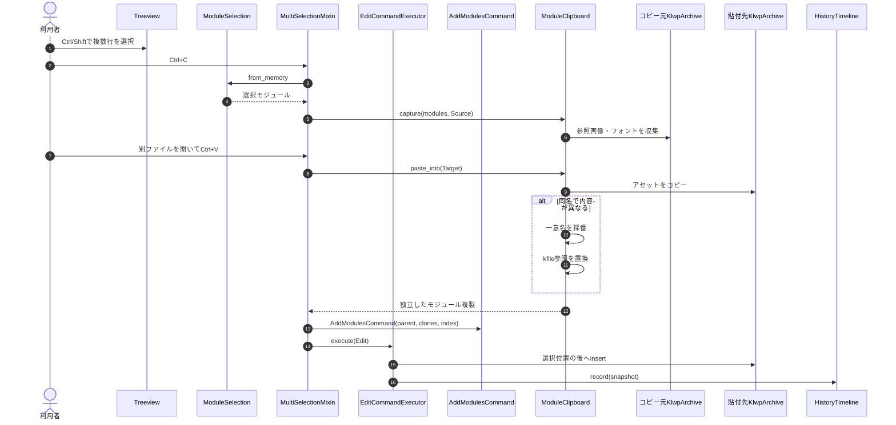
```mermaid
sequenceDiagram
    autonumber
    actor User as 利用者
    participant Tree as Treeview
    participant Selection as ModuleSelection
    participant Commands as MultiSelectionMixin
    participant Executor as EditCommandExecutor
    participant Edit as AddModulesCommand
    participant Clipboard as ModuleClipboard
    participant Source as コピー元KlwpArchive
    participant Target as 貼付先KlwpArchive
    participant History as HistoryTimeline

    User->>Tree: Ctrl/Shiftで複数行を選択
    User->>Commands: Ctrl+C
    Commands->>Selection: from_memory
    Selection-->>Commands: 選択モジュール
    Commands->>Clipboard: capture(modules, Source)
    Clipboard->>Source: 参照画像・フォントを収集
    User->>Commands: 別ファイルを開いてCtrl+V
    Commands->>Clipboard: paste_into(Target)
    Clipboard->>Target: アセットをコピー
    alt 同名で内容が異なる
        Clipboard->>Clipboard: 一意名を採番
        Clipboard->>Clipboard: kfile参照を置換
    end
    Clipboard-->>Commands: 独立したモジュール複製
    Commands->>Edit: AddModulesCommand(parent, clones, index)
    Commands->>Executor: execute(Edit)
    Executor->>Target: 選択位置の後へinsert
    Executor->>History: record(snapshot)
```

### 3.15 複数要素のグループ化／解除

同じ兄弟配列にある静的要素をOverlapLayerへまとめます。グループ化前に各要素の描画境界unionを求め、子要素をunion左上基準の四辺余白へ、作成レイヤーを元の親基準の位置へ変換します。解除時は逆変換するため画面座標は維持されます。位置数式またはアニメーションを持つ要素は意味を変えてしまうため安全側で拒否します。

```mermaid
sequenceDiagram
    autonumber
    actor User as 利用者
    participant Commands as GroupingMixin
    participant Executor as EditCommandExecutor
    participant Edit as GroupModulesCommand
    participant Ungroup as UngroupModulesCommand
    participant Selection as ModuleSelection
    participant Geometry as GroupGeometry
    participant Position as GroupPosition
    participant Items as viewgroup_items
    participant History as HistoryTimeline

    User->>Commands: グループ化
    Commands->>Selection: 同じ親の2件以上か検証
    Commands->>Geometry: item_bounds / union
    Geometry-->>Commands: 画面境界と外接矩形
    Commands->>Position: 子をunion基準の四辺余白へ変換
    Commands->>Position: 新規OverlapLayerを親基準へ配置
    Commands->>Edit: GroupModulesCommand(parent, items, group, index)
    Commands->>Executor: execute(Edit)
    Executor->>Items: 選択要素をレイヤーへ置換
    Executor->>History: record(snapshot)
    opt 解除
        User->>Commands: グループ解除
        Commands->>Geometry: 子の現在境界
        Commands->>Position: 親コンテキストの座標へ逆変換
        Commands->>Ungroup: UngroupModulesCommand(parent, group, children, index)
        Commands->>Executor: execute(Ungroup)
        Executor->>Items: レイヤーを子要素へ置換
        Executor->>History: record(snapshot)
    end
```

### 3.16 選択要素の編集ズームと背景パン

編集表示のズームは100～400%のプレビュー専用状態です。「選択を拡大」は要素の境界が表示領域の約70%へ収まる倍率を計算し、その中心へクロップ位置を移動します。`−` / `＋` とCtrl+マウスホイールは段階的な倍率変更、「全体表示」は100%と原点へ復帰します。ホイール操作は変更前のポインタ位置を文書座標へ変換し、新しい倍率からクロップ原点を逆算することで、ポインタ下の内容を固定したまま拡縮します。WindowsのMouseWheel形式とButton-4/5形式の両方を受け付けます。

ホイール操作中は、直前の高品質全体画像 `_quality_preview` を再利用します。`CachedPreviewImage` は現在のクロップ原点を元画像座標へ逆変換し、420×760以下の表示領域だけをBILINEARで変換します。全要素の再合成は行いません。高品質描画の予約は入力のたびに取り消して140ms後へ置き直すため、最後の入力後に一度だけ `CanvasRendererMixin._render()` が実行され、キャッシュと表示が高品質画像へ更新されます。ズーム倍率、クロップ原点、描画キャッシュ、予約IDは `ApplicationMemory` にだけ保持し、`.klwp` の位置・サイズ・画像には保存しません。

ズーム中もヒットテスト、ドラッグ、リサイズ、タップ判定は文書座標で処理します。画面上のポインタ座標へクロップ原点を加え、描画倍率で割って文書座標へ戻すため、拡大表示がアイテムの保存値を歪めることはありません。

編集モードで拡大中にアイテムのない背景部分を左ドラッグすると、`PreviewPan` がポインタ移動量と逆方向へクロップ原点を移し、背景をつかんで動かす表示になります。原点は描画領域内へ制限し、制限後の位置を次のドラッグ基準にするため、端から反対方向へ戻した時も即座に追従します。倍率と高品質キャッシュの解像度が一致する場合はキャッシュを直接cropし、全要素の再描画は行いません。操作プレビューモードでは従来のページスワイプを優先し、アイテム上では要素移動・リサイズを優先します。

```mermaid
sequenceDiagram
    autonumber
    actor User as 利用者
    participant Zoom as PreviewZoomMixin
    participant Value as PreviewZoom
    participant Memory as ApplicationMemory
    participant Fast as ZoomPreviewRendererMixin
    participant Cache as CachedPreviewImage
    participant Pan as PreviewPanMixin
    participant Canvas as CanvasRendererMixin
    participant Interaction as InteractionMixin
    participant Item as 選択要素

    User->>Zoom: 選択を拡大
    Zoom->>Item: boundsを取得
    Zoom->>Value: for_selection(bounds, document, viewport)
    Value-->>Zoom: 1.0～4.0の倍率
    Zoom->>Memory: preview_zoomと_view_originを保存
    Zoom->>Canvas: _render()
    Canvas->>Value: scale(document, viewport)
    Canvas->>Canvas: 全体を倍率描画して表示領域をcrop
    Canvas-->>User: 選択要素を中心に拡大表示
    User->>Zoom: Ctrl+マウスホイール
    Zoom->>Memory: preview_zoomと_view_originを更新
    Zoom->>Fast: _render_zoom_preview()
    Fast->>Memory: 直前の_quality_previewを取得
    Fast->>Cache: 表示領域だけをBILINEAR変換
    Cache-->>Fast: 420x760以下の一時画像
    Fast-->>User: ポインタ中心を維持して即時表示
    Zoom->>Zoom: 既存予約を取消し140ms後へ再予約
    Zoom->>Canvas: 入力停止後に_render()
    Canvas->>Canvas: 全要素を高品質で一度だけ再合成
    Canvas->>Memory: _quality_previewを更新
    Canvas-->>User: 高品質表示へ差し替え
    User->>Pan: 空いている背景を左ドラッグ
    Pan->>Memory: _view_originをポインタと逆方向へ更新
    Pan->>Fast: 高品質キャッシュの表示領域をcrop
    Fast-->>User: 背景をつかんだ方向へ即時移動
    User->>Interaction: ドラッグまたはリサイズ
    Interaction->>Zoom: _document_point(event)
    Zoom-->>Interaction: (event + crop origin) / scale
    Interaction->>Item: 文書座標の値だけを更新
```

### 3.17 ドラッグスナップ・整列ガイド・ルーラー

スナップは成果物のフィールドを直接扱わず、現在の描画境界とマウス移動量からリリース時の補正量を返します。候補はキャンバス四辺・中心、100単位のルーラー、選択要素を除く全描画要素の左右端／上下端／中心です。画面上4pxを文書単位へ換算した許容幅内では候補位置を一時ガイドとしてCanvasへ重ねますが、ドラッグ中の要素は生のポインタ移動量へ追従します。マウスを離した時にだけ保持した補正量を1回適用し、その結果を履歴へ記録します。

```mermaid
sequenceDiagram
    autonumber
    actor User as 利用者
    participant Drag as InteractionMixin
    participant Bounds as item_bounds
    participant Targets as SnapTargets
    participant Engine as SnapEngine
    participant Result as SnapResult
    participant Position as PositionMutation
    participant Canvas as CanvasGuideMixin
    participant History as HistoryTimeline

    User->>Drag: 選択要素をドラッグ
    Drag->>Bounds: 選択要素と他要素の描画境界
    Drag->>Targets: from_layout(document, bounds, selected)
    Targets-->>Drag: 端・中心・100単位目盛り
    Drag->>Engine: apply(bounds, raw movement, 4px換算)
    Engine-->>Result: リリース用補正量と候補ガイド
    Result-->>Drag: correction / guides
    Drag->>Position: move_by(raw movement)
    Drag->>Canvas: 再描画とマゼンタガイド
    User->>Drag: マウスを離す
    Drag->>Position: move_by(deferred correction)
    Drag->>Canvas: 一時ガイドを消去
    Drag->>History: record(snapshot)
```

### 3.18 メニューバーと常用ツールバー

従来ツールバーにあった全コマンドの恒久的な入口はネイティブメニューバーとし、「ファイル」「編集」「追加」「配置」「プロジェクト」「デバイス」の6分類へ整理します。ツールバーは新規・開く・保存、Undo・Redo、追加プルダウン、コピー・貼付・複製・削除、Android転送の11操作だけを表示します。テキスト・図形・アイコン・画像・レイヤーの追加は1個の `ttk.Menubutton` に集約します。

`EditorCommandCatalog` がメニューとツールバーのラベル・コマンド対応を提供し、`EditorMenuBuilder` と `PrimaryToolbarBuilder` が表示方式だけを担当します。既存のコマンドメソッド、Undo・Redoボタン参照、キーボードショートカットは変更しません。

```mermaid
sequenceDiagram
    autonumber
    participant Bootstrap as BootstrapMixin
    participant Window as EditorWindowBuilder
    participant Catalog as EditorCommandCatalog
    participant Menu as EditorMenuBuilder
    participant Toolbar as PrimaryToolbarBuilder
    participant Memory as ApplicationMemory

    Bootstrap->>Window: build()
    Window->>Menu: build()
    Menu->>Catalog: menu_groups()
    Catalog-->>Menu: 6分類と全コマンド
    Menu->>Memory: menu_barを保持
    Window->>Toolbar: build()
    Toolbar->>Catalog: toolbar_items()
    Catalog-->>Toolbar: 常用11操作と追加メニュー
    Toolbar->>Memory: primary_toolbar・履歴ボタンを保持
```

### 3.19 要素ツリーからのキーボード微調整

左ペインの `Treeview` で要素を選択している場合、矢印キーを選択要素の座標微調整として扱います。通常は1 KLWP単位、Shift併用時は10 KLWP単位です。`ModuleSelection` が返す全選択要素へ同じ視覚方向を適用するため、親レイヤーが異なる複数選択にも対応します。バインドはアプリケーション全体にも設定しますが、文字・数値入力、プルダウン、スライダーなど矢印キー自体に意味がある編集ウィジェットでは微調整を行いません。

`KeyboardNudge` はTkイベントのキー方向とShift状態を移動量へ変換します。実際の保存値は `PositionMutation` が更新し、ルート要素ではアンカー相対オフセット、レイヤー内要素では四辺余白へ変換します。操作後はプレビューとプロパティ欄だけを更新し、ツリーを再構築しないため、フォーカスを維持したまま連続入力できます。1回のキー入力を1件の履歴として記録します。

```mermaid
sequenceDiagram
    autonumber
    actor User
    participant Tree as Treeview
    participant Commands as MultiSelectionMixin
    participant Executor as EditCommandExecutor
    participant Edit as NudgeModulesCommand
    participant Selection as ModuleSelection
    participant Nudge as KeyboardNudge
    participant Position as PositionMutation
    participant History as HistoryTimeline
    participant Preview as CanvasRendererMixin

    User->>Tree: 矢印キー / Shift+矢印キー
    Tree->>Commands: _on_nudge_shortcut(event)
    Commands->>Selection: from_memory(memory)
    Commands->>Nudge: from_event(event)
    Commands->>Edit: NudgeModulesCommand(targets, root, nudge)
    Commands->>Executor: execute(Edit)
    loop 選択された全要素
        Edit->>Position: PositionMutation(item, is_root)
        Nudge->>Position: apply_to(mutation)
    end
    Executor->>History: record(snapshot)
    Executor->>Preview: _render()
    Executor->>Commands: _build_props()
```

## 4. 状態とデータの境界

### 4.1 `ApplicationMemory` の主な内容

`ApplicationMemory` は従来の `memory["key"]` 互換を維持しながら、キーを `MemoryPartitions` が次の責務へ振り分けます。未登録キーは拡張partitionへ隔離されるため、新機能の一時状態が既存責務を直接汚染しません。

| 分類 | キーの例 | 保存対象 |
| --- | --- | --- |
| ドキュメント | `archive`, `device_res`, `preview_values`, `recent_files`, `module_clipboard` | `archive` の内容だけ `.klwp` に保存 |
| 選択 | `selected`, `selected_items`, `tree_map`, `drag_state`, `resize_state`, `tree_drag` | 保存しない |
| プレビュー | `preview_ts`, `preview_scroll`, Switch補間、アニメーション、イベント領域 | 保存しない |
| 表示領域 | `preview_zoom`, `_view_origin`, `_view_pan_state`, `_quality_preview`, `snap_enabled` | 保存しない |
| 履歴 | `history`, `dirty` | 保存しない |
| UI | `menu_bar`, `primary_toolbar`, `tree`, `canvas`, `status`, 各ボタン | 保存しない |
| 拡張 | 既存partitionへ未登録の一時キー | 保存しない |

### 4.2 KLWP値の解決優先順位

`ModuleValueResolver` は、描画プロパティを次の順序で解決します。

1. `internal_formulas[key]` にある Kode 数式
2. `internal_globals[key]` が参照する Global 値または Global 数式
3. モジュール自身の `item[key]`
4. 呼出側が指定した既定値

### 4.3 モジュール描画の振り分け

| `internal_type` | 主な描画先 |
| --- | --- |
| `ShapeModule` | `ShapeRendererMixin` |
| `TextModule` | `TextRendererMixin` |
| `FontIconModule` | `ContentRendererMixin._paint_icon()` |
| `BitmapModule` | `ContentRendererMixin._paint_bitmap()` |
| `KomponentModule` | `ComponentRendererMixin`（`config_scale_value` を適用して再帰合成） |
| `ProgressModule` | `ContentRendererMixin._paint_progress()` |
| `StackLayerModule` | `CompositorMixin._paint_stack()` |
| `OverlapLayerModule` など子要素を持つもの | `CompositorMixin._paint_overlap()` |

## 5. 保守時の更新指針

- `EditorApp` のMixinまたは `EditorServices` の構成機能を追加・削除した場合は「2.1 EditorApp の合成」を更新する。
- KLWP ZIP の格納項目を変更した場合は「2.2」と「3.4」を更新する。
- 描画順、値解決順、子要素の合成方法を変更した場合は「2.3」と「3.2」を更新する。
- 新しいアニメーション反応・アクションを追加した場合は「2.4」「3.5」「3.6」を更新する。
- リサイズ対象・ハンドル・比率制約を変更した場合は「2.1」と「3.7」を更新する。
- 要素ツリーの順序・ドロップ制約を変更した場合は「2.5」と「3.9」を更新する。
- `ApplicationMemory` の状態分類を増やした場合は「4.1」を更新する。
- Mermaid 図のクラス名とメソッド名は、コード上の識別子と一致させる。
- 実装判断の優先基準は `モジュール設計の哲学.md` と一致させる。

## 6. KLWPファイルと互換性の契約

### 6.1 ZIPアーカイブ構造

`.klwp` の実体はZIPアーカイブです。既知エントリーだけを再生成するのではなく、未知エントリーも `ArchiveContents` で保持して往復保存します。

| エントリー | 内容 |
| --- | --- |
| `preset.json` | プリセット情報、ルート、モジュール、Global、数式、イベント |
| `bitmaps/IMG<32桁hex>` | 内蔵画像。参照先は `kfile://org.kustom.provider/bitmaps/IMG<32桁hex>` |
| `fonts/*.ttf` | 内蔵フォント。参照先は `kfile://org.kustom.provider/fonts/<名前>.ttf` |
| `komponents/` | プリセットによって存在するコンポーネント関連データ |
| `preset_thumb_portrait.jpg` | 縦向きサムネイル |
| `preset_thumb_landscape.jpg` | 横向きサムネイル |
| その他 | 未知エントリーとして内容を保持 |

画像IDは `IMG` とUUIDの32桁hexで構成します。旧エディタが生成した28桁IDを読み込んだ場合、`BitmapReferenceNormalizer` がZIP内の名前と `preset.json` 内の全参照を同時に移行します。書出し時のZIPエントリーは、KLWP実機の形式に合わせてUTF-8フラグとdata descriptorフラグを組み合わせた `0x808` を使用します。

### 6.2 `preset.json` のトップ構造

```json
{
  "preset_info": {
    "width": 540,
    "height": 1200,
    "title": "...",
    "id": "uuid",
    "ts": 0,
    "release": 381531008,
    "features": "LOCATION WEATHER ...",
    "xscreens": 2
  },
  "preset_root": {
    "internal_type": "RootLayerModule",
    "background_type": "IMAGE",
    "background_bitmap": "kfile://...",
    "background_color": "#AARRGGBB",
    "internal_formulas": {},
    "internal_globals": {},
    "globals_list": {},
    "viewgroup_items": []
  }
}
```

`preset_info.width/height` は過去の編集解像度を表す場合があり、現在の端末レイアウト寸法としては使用しません。描画ドキュメントは端末解像度から算出します。総ページ数は `xscreens + 1` として解釈します。

`background_type` が省略された実プリセットも存在します。省略時は `SOLID` と解釈し、未知キーは削除しません。保存時は `preset_info.ts` を更新します。

### 6.3 主なモジュール種別

| `internal_type` | 意味と扱い |
| --- | --- |
| `RootLayerModule` | プリセットのルート |
| `OverlapLayerModule` | 子要素を同一領域に重ねるレイヤー |
| `StackLayerModule` | `config_stacking` と `config_margin` で子要素を順番に整列するレイヤー |
| `ShapeModule` | RECT、CIRCLE、OVAL、PATHなどの図形 |
| `TextModule` | 固定文字列またはKode数式を含むテキスト |
| `FontIconModule` | KLWP内蔵SVG形式のアイコン |
| `ProgressModule` | リングまたはバー型の進捗表示 |
| `BitmapModule` | 背景とは別に配置する画像要素 |
| `KomponentModule` | 作者情報とローカルGlobalを持てるサブレイヤー群 |

Komponentの `viewgroup_items` は通常のレイヤーと同じ再帰描画経路を使い、`config_scale_value` を描画、境界、タップ領域へ一様に適用します。

### 6.4 実データから確定した主要キー

- 色は `paint_color: #AARRGGBB`。`paint_style: STROKE` は枠線、線幅は `paint_stroke` を優先し、旧互換として `paint_stroke_width` も解釈する
- 図形は `shape_width/height/corners/type/path` を使用する。PATHは0～100座標系のM/L/H/V/A/C/Q/Zを解釈する
- 図形種別はsampleを基準とし、正方形は `shape_type` 省略、直角三角形は `RTRIANGLE`、六角形は `EXAGON`、角丸四角形は `SQUIRCLE` とする
- `fx_mask: BLURRED` はすりガラス、`CLIP_NEXT` は次要素を切り抜くマスク、`fx_shadow: OUTER` は外側グローとして近似描画する
- 画像塗りは `fx_gradient: BITMAP` と `fx_gradient_bitmap`、画像要素は `bitmap_bitmap/width/alpha` を使う
- BitmapModuleの高さは保存された `bitmap_height` より元画像の縦横比を優先する
- テキストは `text_expression/size/align/filter/family` を使用する。`text_size_type: FIXED_WIDTH` では `text_size` を枠幅として扱う
- FontIconの `icon_icon` は `名前#base64(gzip(SVG全文))`。`icon_set` は検索元セット情報として保持する
- 時計は `config_rotate_mode: CLOCK_SECOND` などを評価する
- Progressは `style_style/style_size/style_height` を使用する
- Stackは `config_stacking` に `HORIZONTAL` を含む場合は横、それ以外は縦に並べる
- 可視性、数式、アニメーション、タップは `config_visible`、`internal_toggles`、`internal_formulas`、`internal_animations`、`internal_events` に保持する
- すべての配置キーは `position_` 接頭辞付きで保存する

### 6.5 往復保存の原則

1. 編集対象以外の辞書キーを保持する。
2. 未知のモジュール、数式、イベントを削除しない。
3. 画像・フォント参照を変更するときは、参照先アセットと全参照元を同時に更新する。
4. UIやプレビューの一時状態を `preset.json` へ保存しない。
5. 公式旧版と実成果物のload→save→loadを回帰試験する。

## 7. 座標・配置の保存契約

### 7.1 ドキュメント単位

- 画面幅は端末解像度によらず720 KLWP単位とする
- 高さは `720 × 端末縦解像度 ÷ 端末横解像度` で算出する
- 1080×2400端末のドキュメント高さは1600単位になる
- `preset_info.width/height` は配置計算へ使用しない

### 7.2 アンカー、オフセット、余白

1. アンカー未指定時の既定値はルート・レイヤー内とも `CENTER` とする。
2. ルート直下の要素は `position_offset_x/y` をアンカーからの距離として保存する。左上からの絶対座標ではない。
3. TOP系アンカーではYオフセットの増加が下方向、CENTER/BOTTOM系では増加が上方向になる。
4. Overlap/Stack内の子要素は `position_padding_left/right/top/bottom` を使用する。子要素へ新しい `position_offset_x/y` を作らない。
5. 左・上アンカーは左・上余白、右・下アンカーは右・下余白、中央系アンカーは両側余白差の半分で配置する。
6. 子要素の余白は、親レイヤーのwrap寸法にも含める。
7. Stackの子は配列順に整列し、四辺余白と `config_margin` を加味する。
8. Overlapは全子要素の描画境界unionからwrap寸法を求める。

`PositionMutation` はドラッグ、直接リサイズ、複製、キーボード微調整で共通利用し、見た目の移動方向を保存形式に応じたオフセットまたは余白へ変換します。配置の読取と変更で別の既定アンカーを使ってはいけません。

### 7.3 配置回帰の代表値

| 対象 | 確認値 |
| --- | --- |
| 時計すりガラス | TOPLEFT、offset 405/135、275×310、corners 36、BLURRED |
| ひとこと | CENTER、offset -160/+320。正のY保存値は見た目上方向 |
| dock Stack | Stack規則で中央整列し、子の任意offsetを絶対座標として扱わない |
| 天気パネル内テキスト | レイヤー内の四辺paddingで移動する |
| dockアイコン中心 | 実測120/237/360/483/603 KLWP単位 |

## 8. 描画・プレビューの契約と近似

### 8.1 描画パイプライン

PillowのRGBAキャンバスへ、背景をcover-cropで描画し、モジュールツリーを後方から前方へ再帰合成します。各要素は値解決、配置、アニメーション変換、種別別描画、blendの順に処理します。

- BLURREDは背景領域の切出し→GaussianBlur→paint colorを35%合成→形状マスクで貼付する
- CLIP_NEXTは次要素を透明レイヤーへ描き、マスクを乗算して合成する
- Komponentはスケールを適用した座標空間で子要素、選択境界、イベント領域を処理する
- 透明なタップ判定Shapeも操作できるよう、イベント対象の再帰boundsを記録する

### 8.2 対応範囲と意図的な制限

| 領域 | 現在の扱い |
| --- | --- |
| Kode | sampleで使われる関数と主要な数学・文字列・色・正規表現を評価。公式全構文ではない |
| 端末値 | 日時、天気、電池、音楽、位置などを編集可能な模擬値で評価 |
| アニメーション | SCROLL、SWITCH、LOOP_2Wと移動、反転移動、FADE、ROTATE、SCALE、色フィルターを近似 |
| 補間 | 直線、加速、減速、OVERSHOOT、BOUNCE |
| 描画効果 | OUTERグロー、線形・放射・Sweepグラデーション、主要blend modeをPillowで近似 |
| テキスト | FIXED_WIDTHの折返し位置は全角1em幅仮定。高さは実フォント計測 |
| フォント | 破損・欠落時はシステムフォントへフォールバック |
| 外部アクション | Intent、URI、音楽、アプリ起動設定は保存・表示するがPCから実行しない |
| 未知設定 | 描画できなくても保持し、保存時に削除しない |

PCプレビューはAndroid/Skiaと完全一致するエミュレーターではありません。「表示できない」と「保存できない」を区別し、最終互換性はKLWP実機で確認します。

### 8.3 テキスト配置の不変条件

テキストの計測と描画は必ず `_text_layout(item)` の同じ結果を使用します。以前の座標ずれは、インクbboxと描画原点、計測用と描画用フォント、複数行の行間、FIXED_WIDTH高さが別々に計算されていたことが原因でした。

- 描画時と同じフォントインスタンス、行間、alignで計測する
- bbox左上のベアリングを差し引き、インク左上を配置計算位置へ合わせる
- `_TEXT_SPACING_U = 4.0` はdoc単位として計測・描画で共有する
- FIXED_WIDTHでは枠幅を固定し、枠内でalignに従って配置する

この経路を変更するときは、TOPLEFT/CENTER/BOTTOMRIGHT、和文・欧文、複数行、FIXED_WIDTHの組合せでインクbboxと期待位置を検証します。

### 8.4 操作中と確定後の描画

ホイールズーム中は直前の高品質画像を軽量拡縮し、入力停止140ms後に全体を高品質再描画します。ドラッグ中のスナップは候補ガイドだけを表示し、リリース時に1回だけ補正します。位置微調整のようにツリー構造が変わらない操作では、ツリーを再構築せずプレビューとプロパティだけを更新します。

## 9. 回帰資料と検証方法

### 9.1 正解データ

| ファイル | 主な用途 |
| --- | --- |
| `sample/sizuka_home.klwp` | 27要素、bitmaps 6枚、fonts 4種、1080×2400向けの主要基準 |
| `sample/genoblanc.klwp` | 46要素、BitmapModuleとKomponentModuleを含む |
| `sample/S041.klwp` | 198要素、StackとShapeを多用する大規模例 |
| `sample/official_v1_Analog.klwp` | 公式version 1互換 |
| `sample/official_v3_CpuAndMem.klwp` | 公式version 3互換 |
| `sample/official_v4_BunchOfText.klwp` | 公式version 4互換 |
| `sample/official_v5_BlurClock.klwp` | 公式version 5互換 |

公式sampleの出典とSHA-256は `sample/README.md` を正とします。sampleは実装へ合わせて書き換えません。

### 9.2 自動検証

```powershell
python -m unittest -v
python tools/check_object_calisthenics.py
```

現在の基準は構造回帰を含む計125テストです。少なくとも次を検証します。

- ZIP/JSON/画像/フォントの往復保存と参照整合性
- 公式v1/v3/v4/v5と実成果物v10/v11/v15の読込・保存後再読込
- アンカー、ルートoffset、レイヤー内padding、Stack/Overlapの配置
- Bitmap縦横比、全図形種別、グラデーション、blend、Komponent倍率
- Global、Kode、背景切替、ページ、タップ、アニメーション
- 選択、コピー、グループ化、直接操作、Undo/Redo、キーボード操作
- UIを起動しない `render_to_image()` による全sample描画

### 9.3 実機画像との差分

```powershell
python tools/compare_preview.py `
  --reference sample/Screenshot_20260720-022511.png `
  --preset sample/sizuka_home.klwp `
  --timestamp 2026-07-20T02:25:00+09:00 `
  --width 108 --ignore-top 5 --ignore-bottom 5 `
  --max-mse 6500 --min-ssim 0.1 `
  --output artifacts/pixel_diff/sizuka_home
```

比較結果はreference、actual、heatmap、metricsとして出力し、RGBのMSE・PSNRとグレースケールのグローバルSSIMを記録します。Androidのステータスバーなど比較対象外の余白は `--ignore-*` で除外します。生成物の `artifacts/` はGit管理対象外です。

## 10. 開発・運用上の制約

### 10.1 構造規約

`test_architecture.py` と `tools/check_object_calisthenics.py` は `klwp/` と `tools/` に対して次を検査します。

- `else` / `elif` を使わず、早期returnまたはディスパッチを使う
- 制御構造のネストは1段、1メソッド30行以内、1クラス250行以内
- 1クラスのインスタンス変数は2個以内
- property/getter/setterデコレータを使わない
- 二段以上のメッセージ連鎖を使わない
- ドメイン標準または公式API以外の名前を省略しない

プリミティブ値と文字列は値オブジェクトで意味を与え、複数対象はファーストクラスコレクションとして扱います。Tkinter、Pillow、JSON、ZIPなどが要求する生の値は外部境界で展開します。規約の意図は `モジュール設計の哲学.md` を参照します。

### 10.2 ブランチとレビュー

- 開発ブランチは `^BR_REVIEW_[A-Z0-9_]+$` に一致させる
- 実装、回帰テスト、設計資料を同じPRで更新する
- unrelatedな変更を同じコミットへ混ぜない
- 正解データである `sample/` を実装都合で変更しない

### 10.3 Androidへの受渡し

保存済み `.klwp` は `/sdcard/Kustom/wallpapers/` へadb転送できます。手動の場合はAndroidの内部ストレージ `Kustom/wallpapers/` に配置し、KLWPの「読み込み」から開きます。KLWPでの保存・書出しにはPro版が必要ですが、読込と壁紙適用は別の操作です。

### 10.4 現在の残課題

1. 公式Kodeの未対応関数を実sampleから段階的に追加する
2. Android 3.82以降の新しいShader表現を調査する
3. adb転送後のKLWPリロードまで含むライブ反映方法を検討する
4. Android側のアプリ／Activity選択支援を追加する
5. 未知キー・未対応構文を破壊せず警告するバリデータを追加する
6. レイヤー内offsetなど、sampleだけで確定できない挙動を実機で継続検証する

完了済み機能を時系列に列挙する引継ぎログは維持しません。現行の対応範囲は本設計仕様、操作方法はREADME、判断原則は `モジュール設計の哲学.md` を正とします。
